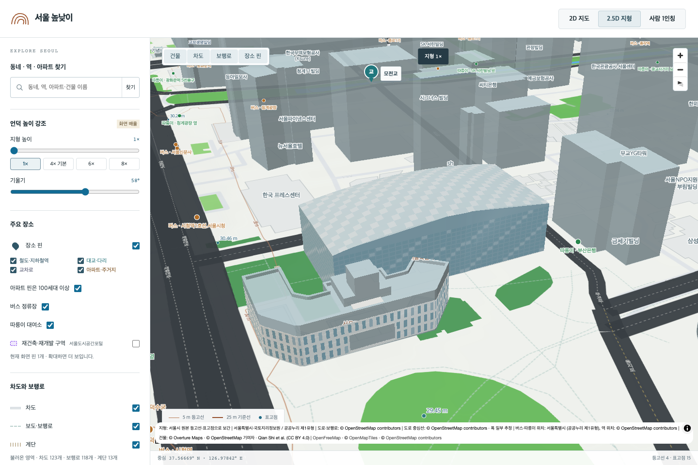
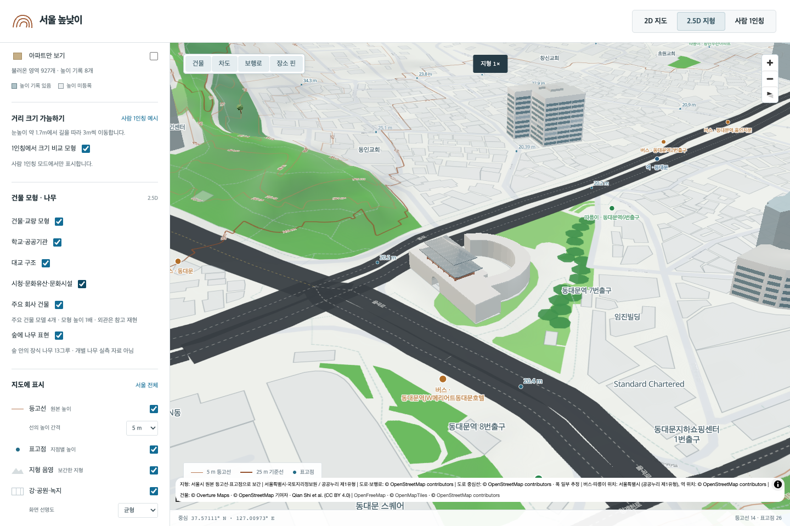
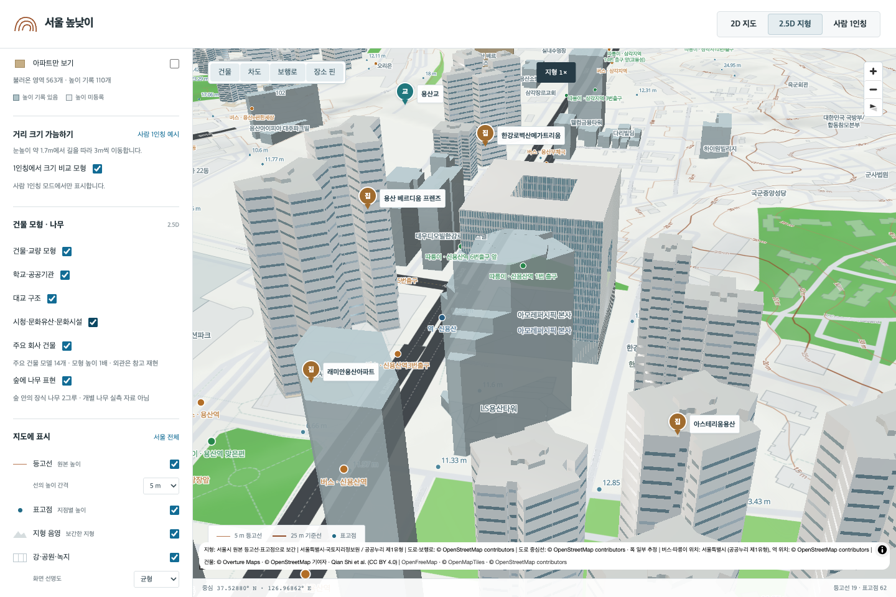
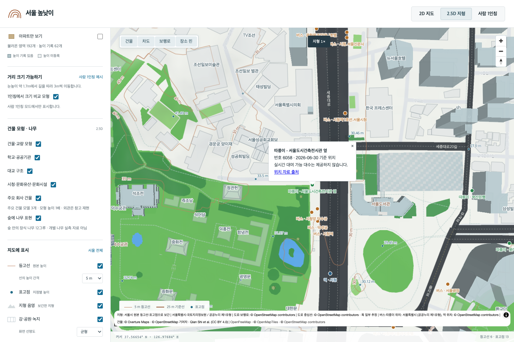

# 시청·문화시설·회사·100세대 이상 아파트 확장

이 문서는 2026-09-19의 **3,088개** 배치를 기록합니다. 후속 주거 모델 확장으로 현재 13,607개이며 [최신 결과](RESIDENTIAL_MODELS.md)를 참고하세요. `688712ee877dbe6ef27bf5127ad6719219eada07`의 1,550개에서 1,538개를 추가했습니다. 기존 시청 ID 한 개는 곡면 유리 외관으로 갱신했고 이전 GLB도 별도 파일로 남깁니다. 나머지 1,549개 레코드·파일과 기존 외곽선 연결은 보존했습니다.

| 이번 작업 | 수량 | 지도에서 보는 방법 |
| --- | ---: | --- |
| 100세대 이상 아파트·주상복합 | 1,514단지 / 원본 건물 윤곽 6,791개 | 단지 검색 후 2.5D 확대 |
| 서울도서관(옛 시청) | 1개 추가 | 시청 앞, 시청·문화유산·문화시설 토글 |
| 성문·사찰·궁궐 건물·문화시설 | 12개 추가 | 같은 토글 |
| 주요 회사 사옥 | 11개 추가 | 주요 회사 건물 토글 |
| 서울특별시청 | 기존 1개 외관 갱신 | 기존 위치와 ID 유지 |
| 서울시 버스 정류소 | 11,218개 | 줌 14부터 점, 줌 16부터 이름 |
| 서울시 따릉이 대여소 | 2,786개 | 줌 14부터 점, 줌 16부터 이름 |



숭례문·흥인지문에는 홍예 통로와 2층 문루, 건춘문에는 단층 문루, 선인문에는 목조 출입구를 구분했습니다. 흥인지문은 옹성 전체가 지붕이 되지 않도록 문루가 놓일 영역을 따로 잡았습니다. 봉은사·조계사와 궁궐 전각에는 기둥·기와지붕을 적용했습니다. 현대 문화시설도 같은 표시 그룹에 포함되므로 `cultural-site`는 법적 문화재 지정 여부를 뜻하지 않습니다.



회사 건물은 현대자동차그룹·현대건설·아모레퍼시픽·LG유플러스·대한항공·중앙일보·CJ·KB손해보험·LG서울역빌딩·포스코피엔에스타워·교보생명빌딩입니다. 명칭은 보유 지도 원본의 건물 이름이며 현 입주사 전수 확인을 뜻하지 않습니다. 아모레퍼시픽은 설계사의 중정·큰 개구부·차양 설명을 참고했습니다. 다른 사옥의 창·외장 배치는 절차적 추정입니다.



버스·따릉이는 서울시 원본 XLSX 좌표를 그대로 변환하고 실제 서울 구 경계로 걸렀습니다. 버스는 2026-09-02, 따릉이는 2026-06-30 기준 위치입니다. 독립적으로 켜고 끄며 점을 누르면 이름·정류소/대여소 번호·자료 기준일·출처가 표시됩니다. 실시간 운행이나 대여 가능 대수는 제공하지 않습니다. 기존 철도 위치 311개와 합쳐 14,315개입니다. [원본 파일·제외 행·좌표 감사](TRANSIT_COVERAGE.md).



## 위치·높이·외관의 정확도

새 아파트는 서울시 공동주택 자료에서 100세대 이상이며 허용한 아파트 분류인 단지를 선정했습니다. 25개 구를 모두 포함하지만 모든 100세대 이상 단지를 확보한 것은 아닙니다. 기존 모델과 겹치거나 위치·분류가 불분명하거나 원본 건물이 없는 후보는 제외했습니다. [구별 수량과 제외 사유](apartment-100-audit.json).

모델은 보유한 실제 건물 윤곽으로 만들었습니다. 다만 아파트 단지와 개별 건물의 소유 관계에는 단지 위치 주변 후보를 가까운 단지에 나누는 추정이 많습니다. 지적도·건축물대장으로 확정한 단지 경계가 아닙니다. 기존 모델 및 새 후보 간 건물 ID 중복, 구 경계 밖 건물은 제외했습니다. [단지별 원본·매칭 근거](apartment-100-candidates.json), [생성 기록](APARTMENT_100_PROVENANCE.json).

높이는 원본 높이, 원본 층수에 층고 3.05m를 곱한 값, 또는 누락 시 추정값을 사용합니다. 숭례문 19m·흥인지문 20m는 서울시 공개 문서의 높이를 참고했지만 그 자료 역시 사진 측량 모델의 기준면을 제공하는 것은 아닙니다. 기와·외장재·창 간격·문루 배치·시청 곡률은 참고 재현입니다. [외관별 자료와 구현 범위](CIVIC_MODEL_DESIGN.md), [높이 자료](civic-height-references.json), [시청 변경 전 레코드와 건물별 높이 근거](CIVIC_COMPANY_PROVENANCE.json).

## 생성과 검증

완료된 추가분을 현재 manifest에 다시 넣지 않습니다. 같은 배치를 재현하려면 별도 체크아웃의 위 기준 커밋에서 이 변경의 생성 스크립트와 후보 문서를 가져오고 원본 DB·구 경계·다운로드 캐시를 준비합니다. 생성기는 기존 모델 및 완료 provenance 덮어쓰기를 거부합니다. 시청 생성은 새 GLB를 먼저 만들고 manifest를 마지막에 바꾸며 오류 시 이전 메타데이터로 복원합니다.

```sh
# 기준 커밋의 1,550개 manifest에서 시작. 현재 3,088개 checkout에 재실행하지 않음.
.venv/bin/python scripts/select_apartments_100.py
.venv/bin/python scripts/build_district_landmarks.py --append-candidates docs/apartment-100-candidates.json --expected-count 1514 --provenance docs/APARTMENT_100_PROVENANCE.json
.venv/bin/python scripts/select_civic_company.py
.venv/bin/python scripts/build_civic_models.py
.venv/bin/python scripts/build_transit.py --download

node scripts/verify_district_landmarks.mjs
node --test tests/*.test.mjs
npm run build
# 별도 개발 서버가 4174에 실행 중일 때
PLAYWRIGHT_BASE_URL=http://127.0.0.1:4174 npx playwright test tests/city-models.spec.ts tests/civic-expansion.spec.ts tests/infrastructure.spec.ts
```

전체 GLB의 해시·크기·바닥·법선·유한 좌표·외부 리소스 부재와 기존 모델 보존을 검증합니다. 브라우저는 대표 모델과 표시 토글·공식 교통 점·팝업·기존 모델의 높이·유휴 렌더링을 확인합니다. 세부 결과는 [검증 요약](landmark-validation-summary.json), [GLB 전수 검사](LANDMARK_ASSET_VALIDATION.json), [새 화면 검사](civic-expansion-browser-check.json)에 있습니다. 데스크톱과 모바일 모두 교통 점을 눌렀을 때 지형 선택이나 모바일 패널이 함께 열리지 않는 것도 확인했습니다. 화면 검사는 표본이며 모든 3,088개를 각기 다른 시점에서 육안 검수한 것은 아닙니다.

현재 활성 GLB 합계는 650,792,772바이트(약 650.8 MB)입니다. 한번에 모두 받지 않고 화면 가까운 최대 32개를 선택하며 동시 로딩 4개, 메모리 보관 48개 제한을 유지합니다. Git에는 코드·생성 GLB·출처 기록만 올립니다. DB·API 토큰·다운로드 원본은 포함하지 않습니다. 기존 로컬 운영 빌드를 갱신하는 작업이며 새로운 공개 웹 호스팅 배포는 아닙니다.
