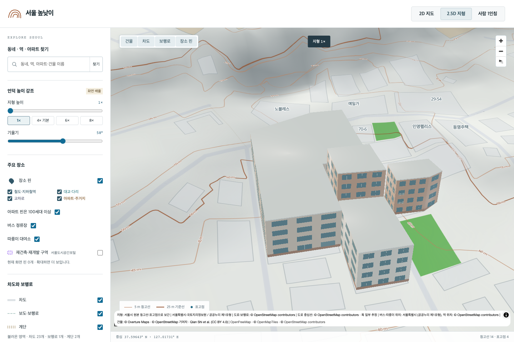
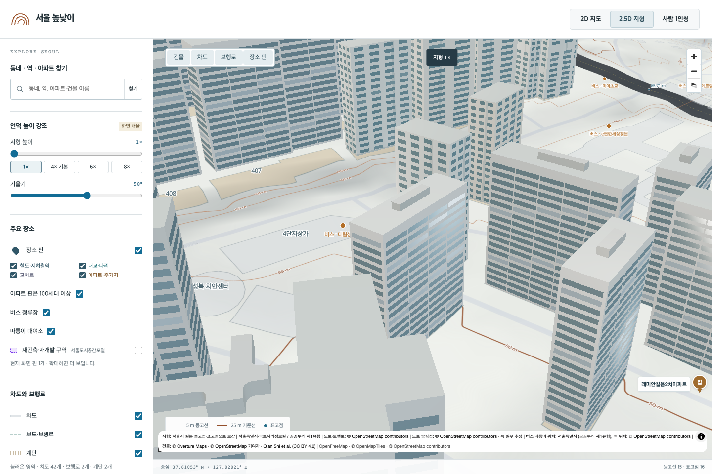
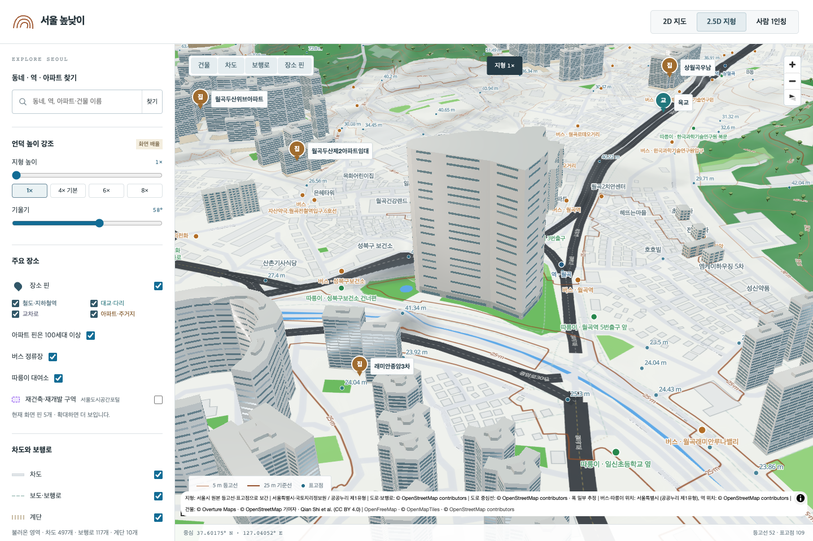
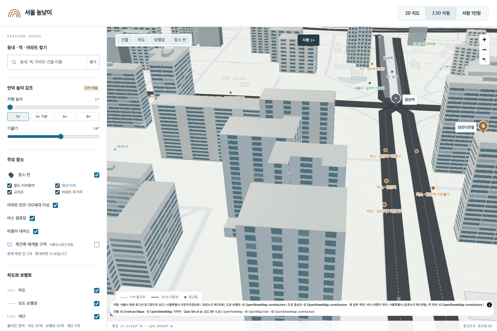

# 빌라·소규모 아파트·주상복합·오피스텔

이 문서는 기존 13,607개 모형 단계의 기록입니다. 이후 공식 도형 전수 조사로 99,516동을 추가했습니다. 최신 총계와 근거는 [추가 전수 조사](RESIDENTIAL_SURVEY.md)를 참고하세요.

기존 3,088개 모델을 그대로 보존하고 **10,519동**을 추가해 총 **13,607개**가 됐습니다. 이번 추가 모델은 단지 단위가 아니라 원본 건물 한 동 단위입니다. 아파트에는 세대수 하한을 적용하지 않습니다. 기존 아파트 핀의 100세대 필터와 별개로 건물 모델은 확대 시 표시됩니다.

| 추가 유형 | 건물 수 |
| --- | ---: |
| 빌라·연립형 주택 | 2,254 |
| 아파트 | 7,963 |
| 주상복합 | 61 |
| 오피스텔 | 241 |
| 합계 | 10,519 |









## 선정 범위와 세대수

보유 Overture 2026-08-19.0 건물 365,456동을 검사했습니다. 원본 이름·용도 또는 위치 검사를 통과한 공식 공동주택 연결로 요청 유형을 식별한 건물은 29,337동입니다. 이 중 이미 모델이 소유한 원본 18,817동은 보존하고, 구 경계 밖 대표점 1동을 제외한 10,519동을 추가했습니다. 새 모델이 소유하는 원본 식별자는 부모 건물 10,519개와 부분 도형 172개, 합계 10,691개입니다. 기존 소유 관계와 중복되지 않습니다.

이름에 빌라·연립·다세대·맨션·맨숀·타운하우스가 있거나 원본이 `residential / terrace`인 건물은 빌라·연립형 외관을 적용합니다. `terrace`는 연속 주택 형태의 원본 분류이며 한국 건축법상 다세대·연립주택의 확정 판정은 아닙니다. 관리사무소·경비실·어린이집 등 부속 시설은 이름 필터로 제외합니다. 원본 이름이 없으면 구 이름·주거 유형·원본 ID 일부로 표시합니다.

공식 공동주택 원본에서는 허용 유형 2,833개 중 기존 모델 2,609개와 좌표 미확정 등 45개를 제외하고 179개를 조사했습니다. 구 경계·원본 도형·기존 소유권을 검사한 **79개 단지 / 424개 건물 후보**를 최종 건물 선정에 연결했고, 나머지 100개는 적합한 미소유 도형이 없어 보류했습니다. 연결된 79개 단지 중 양수 세대수가 **100 이하로 확인된 것은 18개**, 100 초과 14개, 세대수 미등록 47개입니다. 원본 0은 미등록으로 처리합니다. 세대수는 해당 건물 한 동이 아닌 공식 관리단지 전체의 수치입니다. 단지 좌표 주변의 가까운 아파트 도형으로 연결한 경우가 있어 단지 소유 관계는 추정입니다. 명시된 빌라·오피스텔 이름은 근접 아파트 추정보다 우선합니다.

공식 연립·다세대 자료 12건도 조사했지만 같은 구·같은 이름·150m 이내의 미소유 원본 도형을 확정한 사례는 없어 새 도형을 만들지 않았습니다. 그 밖의 336,119동에는 용도 미확인 건물과 단독주택·비주거 등 다른 유형이 포함되어 있습니다. **보유 자료에서 식별 가능한 대상의 처리는 끝났지만, 서울의 모든 실제 빌라·100세대 이하 아파트·오피스텔을 확보한 상태는 아닙니다.**

## 원본 형상과 추정 외관

실제 원본 Polygon/MultiPolygon과 내부 구멍을 유지합니다. 부분 도형이 있는 61동에는 부분별 높이를 적용하고 높은 부분과 겹치는 낮은 지붕은 제거합니다. 건물마다 개별 지형 높이에 올리며, 가까운 여러 동을 하나의 큰 사각형으로 합치지 않습니다.

추가 모델 5,082동은 노출된 모든 부분에 보유 원본 높이를 사용합니다. 나머지는 원본 층수 × 추정 층고 3.05m 또는 명시된 기본값(빌라 4층·아파트 5층·주상복합 8층·오피스텔 10층)을 사용합니다. 원본 높이 자체도 독립적인 실측 검증은 하지 않았습니다. 원본 DB 높이를 덮어쓰지 않으며 모델의 높이 근거를 별도로 남깁니다.

창문·발코니·벽돌색·상가형 저층부·수직 외장은 절차적으로 만든 시각적 추정입니다. 건물마다 사진을 대조해 재현한 정밀 측량 모델은 아닙니다. 원본 외곽선 밖 디테일은 최대 4cm이며 높이를 추가로 부풀리지 않습니다. [외관 설계와 52개 형상 검사](RESIDENTIAL_MODEL_DESIGN.md), [동별 높이·부분 기록](RESIDENTIAL_MODEL_PROVENANCE.json).

## 구별 추가 건물

| 구 | 빌라·연립형 | 아파트 | 주상복합 | 오피스텔 | 합계 |
| --- | ---: | ---: | ---: | ---: | ---: |
| 강남구 | 62 | 475 | 5 | 18 | 560 |
| 강동구 | 4 | 328 | 3 | 4 | 339 |
| 강북구 | 28 | 92 | 0 | 0 | 120 |
| 강서구 | 369 | 450 | 2 | 20 | 841 |
| 관악구 | 37 | 278 | 0 | 33 | 348 |
| 광진구 | 18 | 314 | 0 | 1 | 333 |
| 구로구 | 15 | 297 | 1 | 6 | 319 |
| 금천구 | 28 | 177 | 0 | 13 | 218 |
| 노원구 | 16 | 130 | 0 | 1 | 147 |
| 도봉구 | 8 | 85 | 0 | 0 | 93 |
| 동대문구 | 47 | 368 | 5 | 16 | 436 |
| 동작구 | 14 | 137 | 7 | 1 | 159 |
| 마포구 | 168 | 855 | 3 | 23 | 1,049 |
| 서대문구 | 57 | 214 | 0 | 3 | 274 |
| 서초구 | 15 | 399 | 3 | 19 | 436 |
| 성동구 | 6 | 191 | 4 | 8 | 209 |
| 성북구 | 23 | 133 | 3 | 2 | 161 |
| 송파구 | 31 | 1,163 | 1 | 19 | 1,214 |
| 양천구 | 5 | 296 | 1 | 1 | 303 |
| 영등포구 | 2 | 336 | 3 | 18 | 359 |
| 용산구 | 15 | 156 | 3 | 6 | 180 |
| 은평구 | 1,134 | 546 | 6 | 9 | 1,695 |
| 종로구 | 19 | 134 | 4 | 6 | 163 |
| 중구 | 1 | 127 | 3 | 4 | 135 |
| 중랑구 | 132 | 282 | 4 | 10 | 428 |

## 용량과 지도 로딩

새 GLB는 348,511,496바이트(348.5 MB), 전체 활성 GLB는 999,304,268바이트(999.3 MB)입니다. 새 모델은 줌 16.5부터 로딩 대상이며 화면 근처 최대 32개, 동시 요청 4개, 메모리 보관 48개 제한을 유지합니다. 목록 허용량을 25,000개로 올리고, 같은 화면의 반복 렌더에서는 전체 목록을 다시 순회하지 않도록 가까운 모델 선정을 캐시합니다. 새로운 건물/카메라/표시 조건이 바뀌면 다시 계산합니다.

## 재현과 검증

이번 변경은 PR에 코드·생성 GLB·선정 근거를 올리는 범위입니다. 원본 DB·다운로드 캐시·토큰은 포함하지 않습니다. 이 주거 배치의 공개 호스팅 배포와 병합은 하지 않았습니다. 최신 main의 Vercel 배포 설정을 보존하고 새 모델의 배포용 체크섬 목록도 갱신했습니다. 추후 main에 병합하면 기존 자동 배포가 실행됩니다. 검증용 로컬 Vite는 4174에서 실행했고, 운영 4173의 이전 3,088개 배치는 유지했습니다. 로컬 포트의 실행 여부는 이후 프로세스 상태에 따라 달라질 수 있습니다.

완료된 배치를 현재 manifest에 다시 적용하지 않습니다. 별도 체크아웃에서 기준 커밋 `1f87b16bd9358c063b5e4a3d30b1297c42791c0e`의 3,088개 manifest와 footprint-matches를 준비하고 이 PR의 생성 스크립트를 가져옵니다. 로컬 원본 DB와 구 경계 파일이 필요합니다. 생성기는 기존 provenance 덮어쓰기를 거부하고 이전 GLB 해시를 검사합니다. 캐시는 입력 후보·생성 코드·사용한 원본 도형/높이/층수의 해시로 검증하며, 원본 변경이 감지되면 게시를 중단합니다. 파일을 먼저 준비하고 manifest를 마지막에 게시합니다.

```sh
# 위 기준 커밋의 별도 체크아웃에서 원본 DB와 새 스크립트를 준비한 뒤 실행
.venv/bin/python scripts/audit_residential_expansion_apartments.py
.venv/bin/python scripts/match_residential_complexes.py --manifest public/models/manifest.json --footprints public/models/footprint-matches.json
.venv/bin/python scripts/audit_official_lowrise.py
.venv/bin/python scripts/select_residential_models.py
.venv/bin/python scripts/build_residential_models.py --workers 3

node scripts/verify_district_landmarks.mjs
node --test tests/*.test.mjs
npm run build -- --outDir /tmp/seoul-residential-preview-dist
PLAYWRIGHT_BASE_URL=http://127.0.0.1:4174 npx playwright test tests/residential-models.spec.ts tests/city-models.spec.ts tests/civic-expansion.spec.ts tests/infrastructure.spec.ts
```

- Node 전체 검사 **13,661개 통과**. 이전 3,088개 레코드·GLB 해시·도형 연결 보존, 새 모델의 단일 소유권, 높이 근거, 20,000개 목록에서의 로딩 제한과 캐시 무효화 포함.
- **13,607개 GLB 전수 검사 통과**: 해시·바닥·단위 법선·유한 좌표·인덱스·삼각형 수·외부 리소스 없음.
- 최신 main 반영 후 TypeScript/Vite 빌드 통과. 별도 임시 출력 경로 사용. 배포 자산 16,072개 체크섬과 Python 호스팅/API·DB 검사 11개 통과.
- 브라우저 **4개 시나리오 통과**, 기존 주요 모델·시청·문화시설·인프라·교통 팝업과 새 주거 모델 6개 표본 검사. 모델을 끄면 원본 외곽선 복원, 높이 일치, 오류 없음, 32/48개 제한 유지. 높은 주상복합 화면 구도를 조정한 뒤 새 주거 시나리오도 재통과.
- 고정 시점에서 1초 동안 추가 유휴 프레임 0회. 표본 결과이며 모든 건물의 모든 시점을 육안 검수한 것은 아닙니다.

[선정 감사](RESIDENTIAL_SELECTION_AUDIT.json) · [개별 후보와 출처 URL](residential-model-candidates.json) · [공식 단지 후보](residential-expansion-apartment-pool.json) · [매칭 79개](residential-expansion-complex-matched.json) · [매칭 보류 100개](residential-expansion-complex-rejections.json) · [공식 연립·다세대 보류](residential-expansion-official-lowrise.json) · [브라우저 결과](residential-browser-check.json) · [전체 검증 요약](landmark-validation-summary.json).
