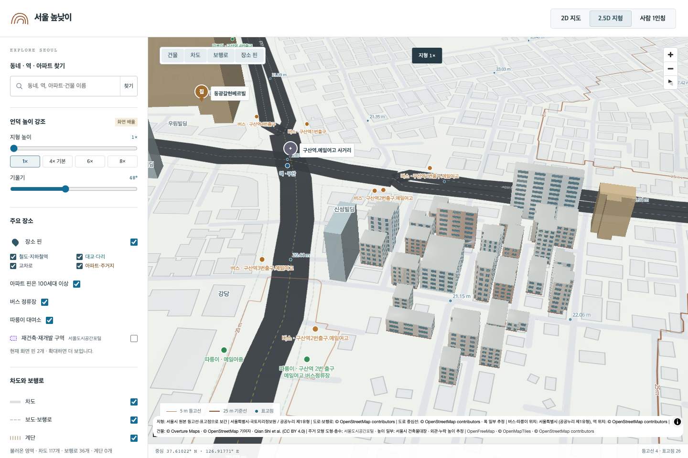
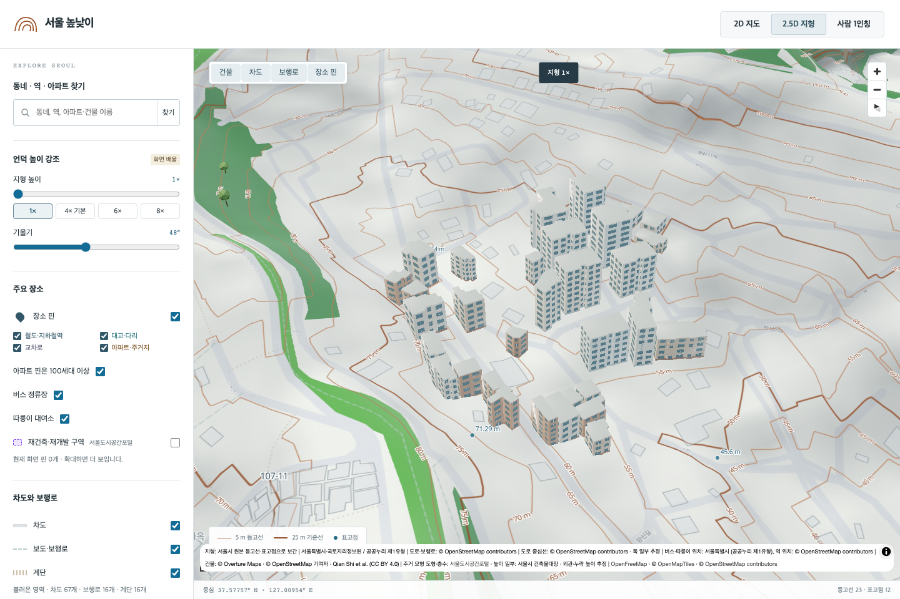
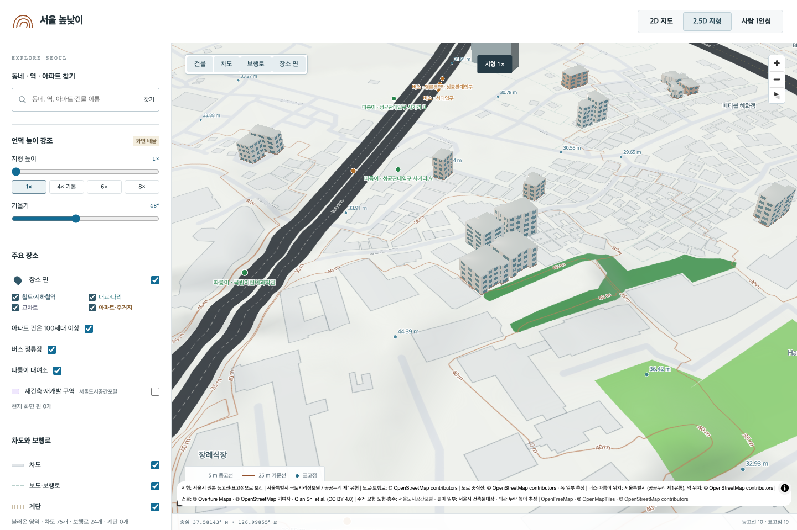

# 서울 주거 모델 추가 전수 조사

2026-09-20에 확보한 서울도시공간포털의 주거 관련 도형 **131,618건 전부**를 기존 모형·건축물대장·도로명주소 자료와 대조했습니다. 기존 13,607개를 보존하고 **99,516동을 추가**, 총 **113,123개** 모형을 구성했습니다. 서울의 모든 실제 건물이 빠짐없이 확인됐다는 의미는 아닙니다. 공개 원본에 없거나 용도·도형을 확정하지 못한 건물은 남아 있습니다.

## 추가한 건물

| 종류 | 개별 건물 수 |
|---|---:|
| 빌라·다세대·연립형 | 74,203 |
| 아파트 | 5,143 |
| 주상복합 | 489 |
| 오피스텔 | 1,596 |
| 세부 유형 미상 공동주택 | 18,085 |
| 합계 | 99,516 |

세대수 하한을 두지 않았습니다. 아파트 수는 단지 수가 아닌 개별 도형 수입니다. 대장 세대수가 없는 건물을 임의로 100세대 이하로 분류하지 않습니다. `multifamily`는 공식 주용도가 공동주택이지만 세부 유형이 확인되지 않은 경우이며, 모두 빌라라고 표시하지 않습니다.

## 확보 범위와 남은 건물

[서울도시공간포털](https://urban.seoul.go.kr/view/map/main.html)의 공개 UPIS MapServer 86번 건물 레이어를 사용했습니다. 조회 시 전체 레이어는 591,303건이었습니다. 기본 조회는 주용도 공동주택·업무시설 또는 이름에 오피스텔이 포함된 117,935건입니다. 상세 용도와 이름의 아파트·다세대·연립·주상복합·빌라 등으로 다시 조회해 기존 조회에서 빠진 13,683건을 추가했습니다. 상세 조건은 `scripts/fetch_residential_survey.py`에 있습니다.

[수집 조건·시각](residential-survey-source-snapshots.json)과 264개 배치의 원본 ID 집합·SHA-256을 보존하고 131,618건의 처리 결과를 모두 기록했습니다. 원본의 제작·갱신 기준일은 명시되지 않아, 2026-09-20은 수집 날짜만 뜻합니다. 기존 Overture의 일반 주택·단독주택 분류를 빌라로 일괄 변경하지 않았습니다.

| 처리 결과 | 건수 |
|---|---:|
| 새 모형 생성 | 99,516 |
| 대상 외 용도·상가·부속 시설 등 | 20,052 |
| 기존 모형과 겹쳐 기존 모형 보존 | 11,070 |
| 원본 입체와 겹치지만 대응 확정 불가 | 192 |
| 면적 기준 밖 또는 활용 불가 | 767 |
| 기존 부분 도형 전체를 포함하지 못함 | 5 |
| 잘못된 도형 | 11 |
| 서울 구 경계 밖·구 확정 불가 | 2 |
| 다른 공식 도형과 중복 | 3 |
| 합계 | 131,618 |

중복 도형의 대체 관계를 추측해 겹쳐 쌓지 않습니다. 확인되지 않은 항목은 사유를 남겨 다음 조사에서 재검토할 수 있습니다. 원본 전수 판정 DB는 로컬 `data/model-source/residential-survey/selection.sqlite`, 공개 집계·배치 해시는 [감사 JSON](RESIDENTIAL_SURVEY_AUDIT.json)에 있습니다.

## 위치·높이·외관

- 공식 Polygon/MultiPolygon의 외곽선과 구멍을 보존하고 건물마다 독립적인 지면 앵커를 사용합니다. 파사드 장식의 미세한 돌출은 있습니다.
- 대장 585,194행과 도로명주소 건물 DB 593,178행을 별도 색인했습니다. 건물관리번호·현재 필지번호·구·지번주소·도로명주소를 대조하고, 하나의 주건축물로 연결되는 경우에만 대장 속성을 검토했습니다. 산/대지, 지하/지상 구분을 보존합니다.
- **71,452동**은 고유 주소 연결에 더해 층수·사용승인연도가 일치하고 층당 높이가 합리적인 대장 높이를 사용합니다. 공식 공통 식별키의 직접 결합이나 독립 실측을 뜻하지 않습니다.
- **71동**은 양쪽 도형의 겹침이 각각 80% 이상인 Overture의 기록 높이를 사용합니다.
- **26,643동**은 공식 층수 × 추정 층고 3.05m입니다. 높이·층수 모두 없는 **1,350동**은 종류별 4/5/8/10층 참고 모형입니다.
- 여러 공식 도형이 같은 대장 하나를 가리킨 **980개 대장 기록**은 높이·세부 유형을 전달하지 않았습니다.
- 창문·발코니·출입구·옥상 표현은 절차적 모형입니다. 사진을 이용해 실제 입면이나 재료를 복원한 결과가 아닙니다. 건물별 `sourceRecord.heightBasis`와 `heightEstimated`로 근거를 남깁니다.

원본 건물·아파트 DB는 수정하지 않았습니다. 기존 모형의 기록·GLB·footprint 연결은 모두 유지했습니다. 신규 모형이 대체하는 기존 외곽선 ID는 30,857개이며, Overture에 대응 도형이 없는 공식 건물도 새 도형으로 표시합니다. 모델을 끄면 원래 외곽선 표시가 복원됩니다.

## 로딩과 용량

새 모형은 **1,660개 지역 타일**로 나눴습니다. 줌 16.5 이상에서 가까운 16개 타일만 요청하며, 메타데이터는 최대 32개 타일을 보관합니다. 메타데이터 요청은 동시에 4개, GLB 요청은 동시에 4개입니다. 기존 GLB의 활성 32개·메모리 보관 48개 제한도 유지합니다. 최대 타일은 396동/709,664바이트입니다.

신규 GLB는 **1,776,672,456바이트**, **23,852,537삼각형**입니다. 기존 활성 GLB를 합치면 **2,775,976,724바이트**입니다. 이 전체를 브라우저 시작 시 다운로드하지 않습니다. 배포 준비 스크립트는 신규 타일과 GLB까지 포함한 117,249개 자산의 SHA-256을 검사합니다.

[생성 근거](RESIDENTIAL_SURVEY_PROVENANCE.json), [대장 색인 감사](residential-survey-register-audit.json), [GLB 전수 검증](LANDMARK_ASSET_VALIDATION.json)을 보존했습니다. [실제 브라우저 검사](residential-survey-browser-check.json)는 빌라·소규모 아파트·주상복합·오피스텔·유형 미상 공동주택 6개 사례의 위치·높이·개별 지면 배치를 확인했습니다. 69개 지역 타일을 이동해도 메타데이터 32타일, GLB 48개, 활성 모형 32개 제한을 지켰습니다. 브라우저 오류와 실패한 HTTP 응답은 없었습니다. 이는 대표 화면 검사이며, 모든 건물 외관을 개별 육안 검수한 것은 아닙니다.







## 구별 추가 수

| 구 | 빌라·연립 | 아파트 | 주상복합 | 오피스텔 | 유형 미상 공동주택 | 합계 |
|---|---:|---:|---:|---:|---:|---:|
| 강남구 | 2,461 | 181 | 20 | 31 | 1,052 | 3,745 |
| 강동구 | 3,684 | 293 | 23 | 52 | 491 | 4,543 |
| 강북구 | 3,199 | 113 | 10 | 24 | 1,882 | 5,228 |
| 강서구 | 5,942 | 404 | 68 | 193 | 370 | 6,977 |
| 관악구 | 2,915 | 204 | 11 | 158 | 2,146 | 5,434 |
| 광진구 | 3,628 | 189 | 11 | 73 | 790 | 4,691 |
| 구로구 | 3,496 | 462 | 64 | 59 | 157 | 4,238 |
| 금천구 | 1,884 | 173 | 22 | 103 | 523 | 2,705 |
| 노원구 | 1,579 | 301 | 17 | 14 | 149 | 2,060 |
| 도봉구 | 2,393 | 247 | 23 | 63 | 1,068 | 3,794 |
| 동대문구 | 1,421 | 174 | 3 | 30 | 364 | 1,992 |
| 동작구 | 3,510 | 250 | 30 | 18 | 321 | 4,129 |
| 마포구 | 3,521 | 121 | 15 | 92 | 338 | 4,087 |
| 서대문구 | 2,732 | 159 | 10 | 51 | 839 | 3,791 |
| 서초구 | 2,086 | 367 | 14 | 23 | 1,525 | 4,015 |
| 성동구 | 1,149 | 97 | 17 | 34 | 121 | 1,418 |
| 성북구 | 3,385 | 126 | 4 | 30 | 331 | 3,876 |
| 송파구 | 5,220 | 168 | 8 | 37 | 2,418 | 7,851 |
| 양천구 | 4,305 | 330 | 50 | 42 | 553 | 5,280 |
| 영등포구 | 1,093 | 113 | 10 | 137 | 412 | 1,765 |
| 용산구 | 2,417 | 158 | 10 | 9 | 410 | 3,004 |
| 은평구 | 7,293 | 183 | 38 | 190 | 121 | 7,825 |
| 종로구 | 1,913 | 76 | 6 | 29 | 391 | 2,415 |
| 중구 | 690 | 60 | 1 | 23 | 241 | 1,015 |
| 중랑구 | 2,287 | 194 | 4 | 81 | 1,072 | 3,638 |

## 재현

기존 13,607개 모형의 기준 커밋은 `3d99ccea9971e9963452b68777fec6845917955e`입니다. 원본 SQLite·대장 CSV는 Git에 포함하지 않습니다. 재생성에는 로컬 원본 또는 동일 해시의 사본이 필요합니다. 완성본을 덮어쓰는 재실행은 거부합니다. 별도 체크아웃에서 기준 커밋의 모형을 준비하고 현재 조사 스크립트를 적용합니다.

```sh
.venv/bin/python scripts/index_residential_register.py
.venv/bin/python scripts/fetch_residential_survey.py
.venv/bin/python scripts/fetch_residential_survey.py --supplemental
.venv/bin/python scripts/select_residential_survey.py
.venv/bin/python scripts/build_residential_survey.py
node scripts/verify_district_landmarks.mjs
.venv/bin/python -m unittest discover -s tests -p 'test_residential_survey*.py' -v
node --test tests/*.test.mjs
```

공개 서비스의 ID 집합이 바뀌면 기존 수집에 섞지 않고 중단합니다. 기존 원본 배치 해시와 고정 ID 집합을 검증하는 재개 수집을 지원합니다. 이번 변경은 PR 검토용이며 운영 반영은 main 병합·배포 후 별도 확인합니다.
