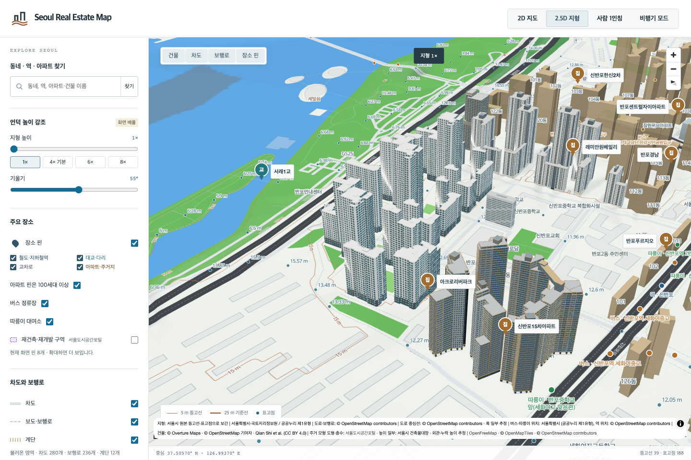

# 아크로리버파크 15개 동 검토

100–114동을 각각의 원천 윤곽과 위치로 반영했다. 단지 공식 사진에서 검토한 외관을 같은 단지의 다른 동에 적용했다. 사진 속 동 번호와 촬영 방향은 확정하지 못했으므로, 개별 동의 모든 외관을 사진으로 검증했다는 의미는 아니다.

## 형태와 높이

이전의 같은 높이로 솟은 모델에서 원천 부분 도형의 층수를 반영한 계단형 지붕으로 수정했다. 부모 건물의 높이는 OSM 추정치이며, 부분의 미터 높이는 층수 비례로 계산했다. 건축물대장의 실측 높이로 표시하지 않는다.

| 동 | 부분별 층수 | 적용한 높이(m, 추정) |
|---|---|---|
| 100 | 21 / 19 / 17 | 74 / 66.95 / 59.90 |
| 101 | 26 / 22 | 90 / 76.15 |
| 102 | 22, 부분 자료 없음 | 77, 동일 높이 가정 |
| 103 | 35 / 34 | 122 / 118.51 |
| 104 | 32 / 16 | 110 / 55 |
| 105 | 30 / 3 | 105 / 10.5 |
| 106 | 33 / 30 | 115 / 104.55 |
| 107 | 19 / 13 | 68 / 46.53 |
| 108 | 19 / 13 | 68 / 46.53 |
| 109 | 38 / 37 | 132 / 128.53 |
| 110 | 30 / 20 / 3 | 105 / 70 / 10.5 |
| 111 | 22 / 14 | 79 / 50.27 |
| 112 | 19 / 14 | 68 / 50.11 |
| 113 | 19 / 13 | 68 / 46.53 |
| 114 | 38 / 37 | 132 / 128.53 |

100동의 19층 부분은 [OSM way544771983의 과거 기록](https://api.openstreetmap.org/api/0.6/way/544771983/history)에서 확인했다. 현재 태그에서는 층수가 지워졌으나, 변경되지 않은 도형이 부모 건물의 남은 영역과 정확하게 일치한다.

110동에서 분리되어 있던 20층 연결부는 [이름이110인 원래 OSM relation7766718](https://api.openstreetmap.org/api/0.6/relation/7766718/1)의 구성원이었다. 도형 이력을 대조해110동으로 묶었다. 현재 관계에서 빠져 있다는 사실과 과거 자료를 사용한 판단을 함께 남겼다. 별도 건물인 반포파크빌은 합치지 않았다.

## 검증과 남은 추정

실제 Blender MCP로 작성한 수정본14개와 기존102동의 GLB·편집 가능한 Blender 파일·동별4방향 렌더를 검토했다.14개 수정본은 부분별 도형과 층수를 원천 기록에 대조했고, GLB의 실제 삼각형을 높이 평면에서 잘라 낮은 지붕 위에 높은 몸체가 남아 있지 않은지 확인했다. 돌출 창턱 때문에 경계에서0.60m는 별도 허용하며, 지붕 면의 덮임은0.03m 안쪽에서 다시 확인한다.

100·109동의 이전 게시물과 파일은 그대로 보존하며 새 수정본이 우선 표시된다. 기존 단지 모델의22,153개 삼각형은 재생성과 바이트 대조를 거쳐15개 동별 대체 모델과 반포파크빌로 보존했다.110동은2개 원천 도형을 소유한다.

창문 간격, 유리와 벽의 배치, 색, 옥상 설비와 사진에 보이지 않는 면은 대표 외관을 바탕으로 한 추정이다. 조경·실내·공용시설 전체를 재현한 모델은 아니다. 원본 사진은 공개 모델이나 Blender 파일에 삽입하지 않았다.

- [공식 단지 사진 출처](https://www.acro.co.kr/MPosm_main.action?commonMap.CD_BIZ_LND=010366)
- [원본 모델 분할 및 이력 증거](acro-riverpark-generic-split.json)
- [모델별 비교 기록과 실제 MCP 실행 기록](published-bespoke.json)
