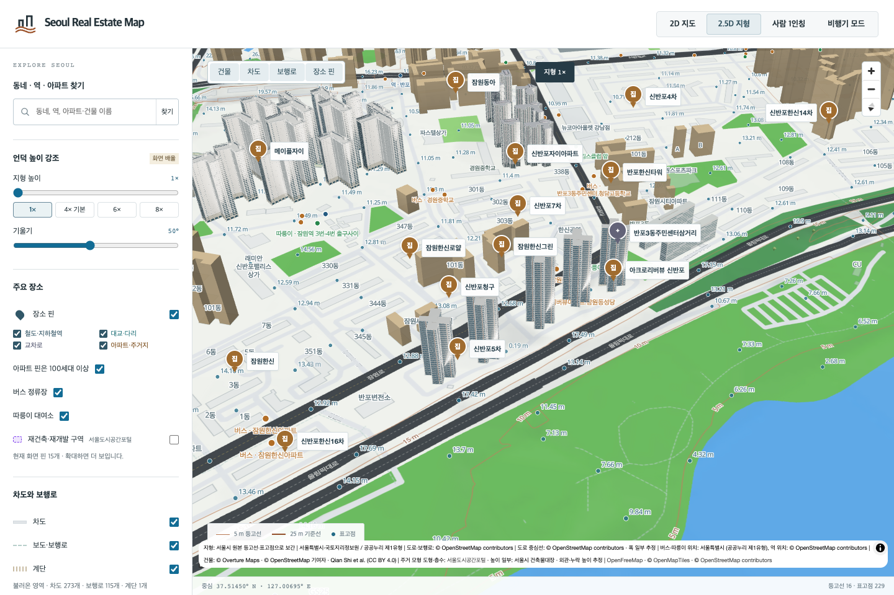
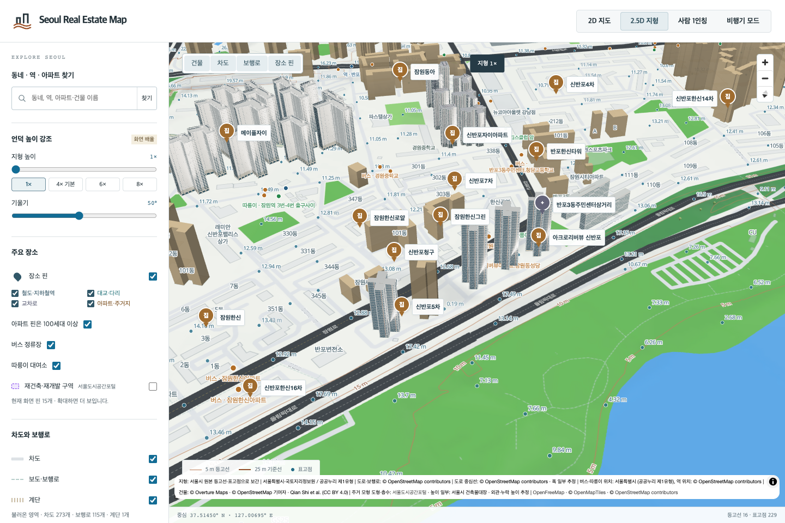
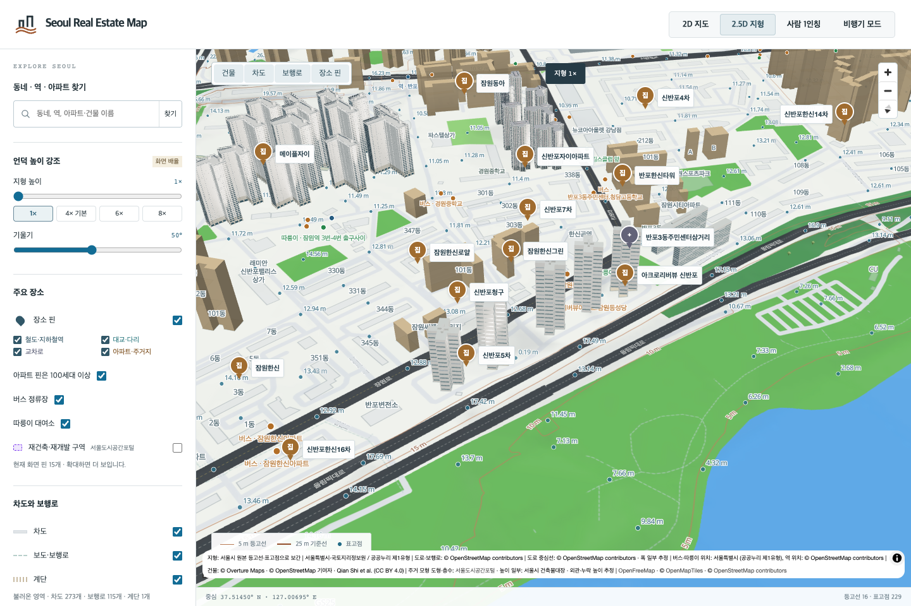

# 아크로리버뷰 신반포 5개 동 검토

잠원로117·잠원동159의 아크로리버뷰 신반포101–105동,595세대입니다. 아크로리버파크와 다른 단지입니다. 명명된 OSM경계413354844 안의 원천 도형5개와 정확한 주소·동 번호의 대장 행을 독립 대조했습니다. [동별 출처](acro-riverview-source-identity.json)

[당근 페이지](https://realty.daangn.com/complexes/10707418/reviews/19303)의 단지명이 붙은 매물 카드와 동일 이미지 UUID의 썸네일·원본 연결을 확인했습니다. 원본1440×1080 사진은 화면을 다시 촬영한 이미지로 모아레가 있고, 앞쪽 지붕은 잘려 있습니다. 거주자가 직접 올린 후기 사진으로 입증한 것은 아닙니다. 흰 수직 프레임, 넓은 가로 유리 띠, 좁은 서비스 창, 갈색 수직 이음부를 대표101동에 적용하고, 나머지4동은 각자의 외곽·층수·높이를 유지하며 같은 외관을 추정 적용했습니다.

모든 모델은 기존 Blender MCP에서 제작하고 개별 파일을 재로드했습니다. 최종20방향 렌더를 직접 검토했습니다. GLB삼각형을 독립 분석해 지면·지붕 면 누락 없이 원천 도형이 유지되고, 대장 최대높이와 층수가 맞으며, 전체 돌출0.281m미만·지붕 구조의 도형 내부 포함을 확인했습니다. 동별 높이는93.55·99.35·105.15·96.45·84.85m, 층수31·33·35·32·28층입니다. 부분 높이 원천 자료가 없어 각 동의 전체 외곽을 최대높이로 올리는 가정이 남습니다. 촬영 동 번호·방향, 뒷면, 색과 창·지붕 치수는 실측으로 주장하지 않습니다.

과거 데이터의 아크로리버뷰 묶음에는101–103동과 별개의112·113동이 함께 있었고,104·105동은 신반포5차로 잘못 묶여 있었습니다. 원본 두 파일을 당시 생성 순서로 재현해 바이트 일치를 확인한 뒤4,004개 삼각형을 원래 건물 소유별로 분리했습니다.112·113동은 별도 잔여 모델로 보존했습니다. 기존 원본 파일을 덮어쓰지 않았습니다. [분리·보존 기록](acro-riverview-generic-split.json)

브라우저에서 정상 표시,101대표 실패,서로 다른 원본 묶음의102·104동 혼합 실패,104동의 새 모델·대체 모델 동시 실패 시 원본 도형 복원,전체5동 대체 모델 복원을 확인했습니다. 모든 경우 인접112·113동 잔여 모델이 함께 표시됐습니다.

[검증 기록](acro-riverview5-local-validation.json): Node13,791개,관련Python41개,브라우저5개,빌드 통과. 서울 전체1,417관리코드 중20개가 현재 검토 기준을 충족합니다. 전체 서울 완료를 의미하지 않으며, 원본 사진은 로컬 조사에만 보관합니다.
