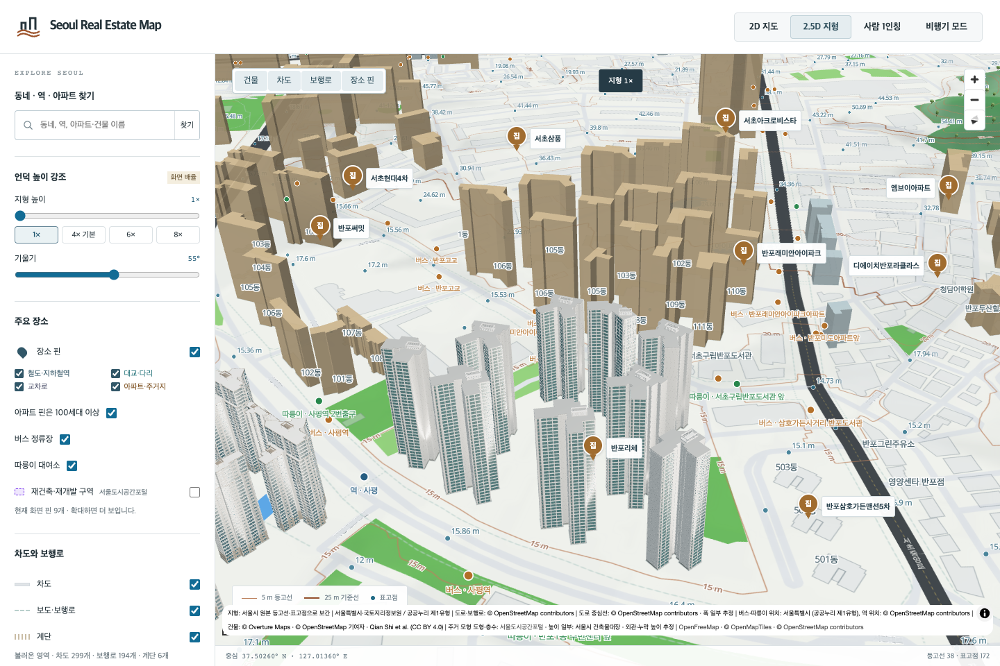
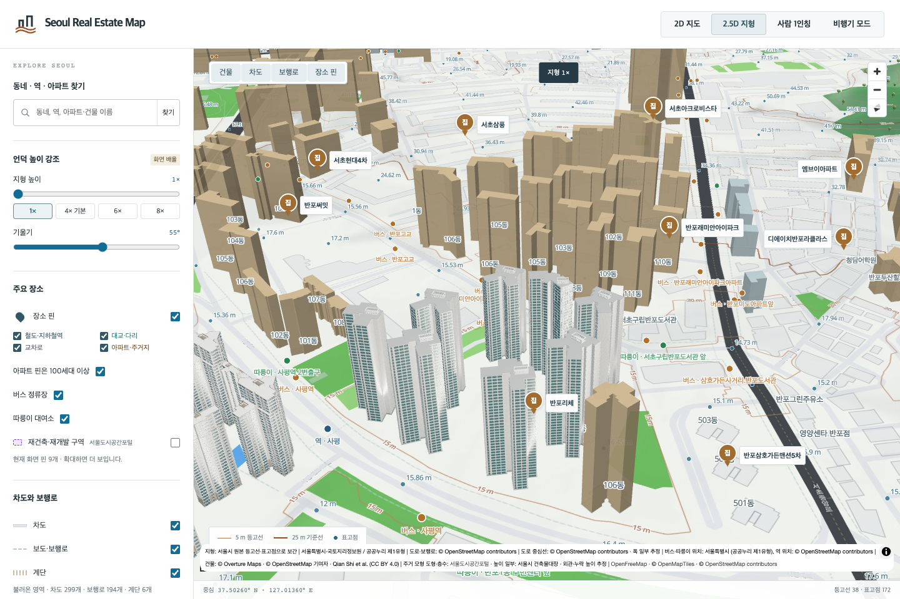
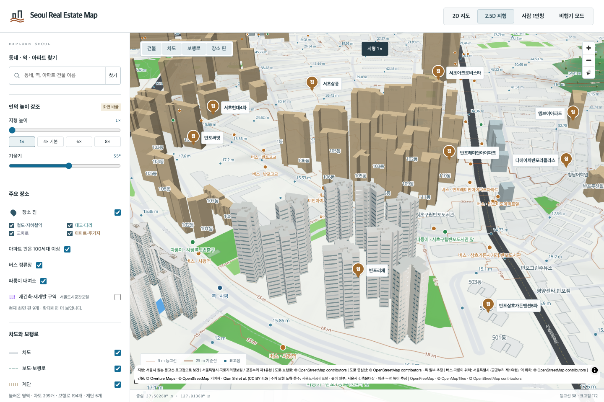

# 반포리체 9개 동 검토

고무래로35·반포동30-26의 반포리체101–109동,1,119세대입니다. 명명된 OSM경계333075749와 동별 원천 도형, 정확한 주소·동 번호의 주건축물대장 행을 독립 대조했습니다. [동별 출처](banpo-riche-source-identity.json)

[KB23387](https://kbland.kr/se/c/23387)의 본문 데이터에서 반포리체 정보와 같은 객체의 photoList가 연결한1920px 완공 사진을 확인했습니다. 추천 단지 사진은 사용하지 않았습니다. 넓은 막힌 회색 벽, 패널 줄눈, 두꺼운 흰 기둥과 가로 띠, 청록색 창, 좁고 어두운 서비스 창, 사각 지붕 격자를 대표101동에 반영했습니다. 나머지8동은 각자의 외곽·높이·층수를 보존하며 면의 방향·길이·오목한 지점을 기준으로 창과 막힌 벽을 나눴습니다.101동의 면 번호를 그대로 다른 동에 복사하지 않았습니다.

기존 Blender MCP로 제작·렌더·독립 재로드했습니다. 총36방향의 최종 렌더를 직접 검토하고 GLB삼각형을 읽어 전체 지면·지붕 면, 대장 높이,0m기저,0.275m미만 돌출,지붕 구조의 도형 내부 포함을 검사했습니다. 사진 속 동 번호·방향과 창·뒷면·색·지붕 치수는 확정하지 않았습니다. 부분 높이 자료가 없으므로 각 동 전체 외곽에 대장 최대높이를 적용한 가정을 명시합니다.

기존8동 묶음은 당시 생성 과정을 바이트 단위로 재현한 후7,529개 삼각형을 원래 소유 건물별로 나눴습니다.35개 삼각형의 과거 볼록껍질 근사와 최대2.068m돌출은 기존 대체 모델에 보존하며 새 모델의 정밀도로 주장하지 않습니다. 별도106동 모델은 원본 ID·파일·메타데이터를 그대로 유지했습니다. [분리 기록](banpo-riche-generic-split.json) · [동별 대체 모델](banpo-riche-fallback-bindings.json)

브라우저에서 정상 표시,101대표 실패,102·106동 혼합 실패,103동과106동 각각의 새 모델·대체 모델 동시 실패 시 원본 지도 복원,9동 전체 대체 모델 복원을 확인했습니다.

[검증 기록](banpo-riche9-local-validation.json): Node13,794개,관련Python42개,브라우저6개,빌드 통과. 직전eb4710def의220bespoke·125reference·13,607generic기록,이전수정15건과GLB/Blender113,739파일 보존을 대조했습니다. 서울 전체1,417관리코드 중21개가 현재 검토 기준을 충족하며, 전체 서울 완료는 아닙니다. 원본 사진은 로컬 조사에만 남깁니다.
