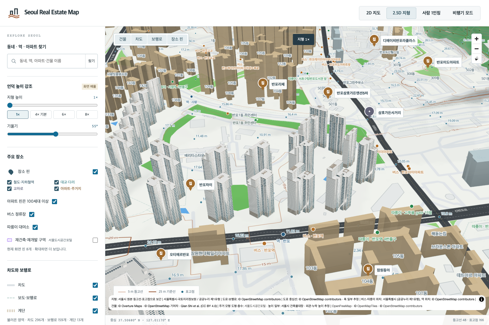
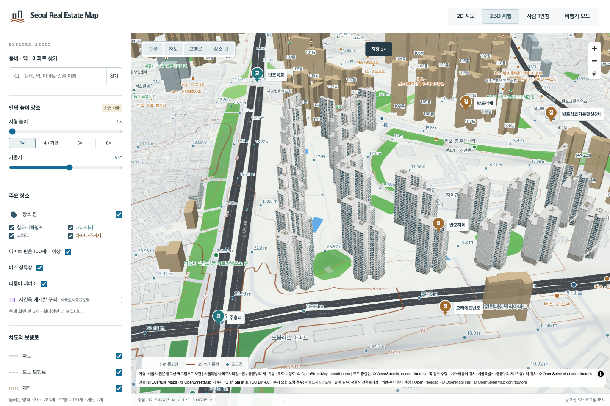
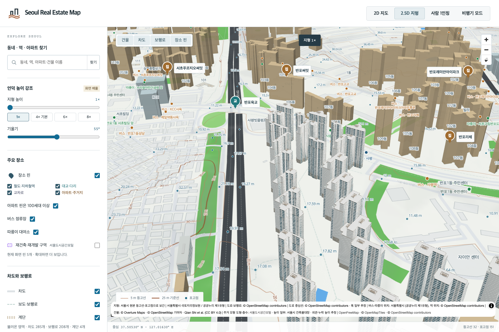

# 반포자이 43개 동 검토

반포자이 44개 주거동 중 101·102·104–144동을 개별 Blender 모델로 반영했습니다. 103동은 건축물대장에 27층·57.7m로 기재되어 높이 충돌을 해결하기 전까지 원래 모델을 유지합니다. 단지 전체를 완료로 집계하지 않습니다.

- Luna 조사 자료를 원본 DB·대장과 별도로 대조했습니다. 반포동 20-43 / 신반포로 270의 주건축물 44개 행과 세대수 합계 3,410, OSM 단지 경계 165196918 안의 유일한 동별 도형을 확인했습니다. 신반포자이의 경계 414371716은 사용하지 않습니다. OSM 경계는 지적측량 도면이 아닙니다.
- [KB 반포자이 페이지](https://kbland.kr/se/c/15891)의 단지 상세 이름·주소와 같은 데이터 객체의 사진 목록으로 원본 사진 귀속을 확인했습니다. 페이지 번호와 사진 저장 번호는 다릅니다. 참고 사진은 로컬에만 보관합니다.
- 101동에서 검토한 창호·서비스 벽면·밝은 수평 줄눈·어두운 기단·열린 지붕 프레임을 나머지 42개 동의 고유 도형에 적용했습니다. Astra가 기존 Blender MCP에서 제작했습니다. 172장의 최종 전·후·측면·지붕 렌더를 root가 직접 검토했습니다. 개별 동 사진이나 촬영 방향은 확인되지 않았습니다.
- 최대 높이·층수는 동별 대장 값입니다. 하위 높이 도형이 없어 낮은 날개의 범위·층수는 추정입니다. 실제 GLB의 원본 지면 외곽, 양쪽 지붕 면의 덮임, 낮은 부분 위로 잘못 솟은 형상 유무, 최대 높이를 별도로 검사했습니다. 창 크기·방향·색·장식과 법정 높이의 지붕 기준은 실측되지 않았습니다.
- 29개 동과 다른 건물 16개를 묶었던 기존 모형은 22,551개 원본 삼각형을 정확히 나누었습니다. 주변 건물 16개와 모든 원본 속성·지형 기준을 보존합니다. 116동의 잘못된 단지 명칭만 바로잡고 기존 파일은 보존했습니다. 별도의 지도 장소 핀 이름까지 수정한 것은 아닙니다.
- 멀리 있는 과거 모델의 수정본이 가까운 새 동을 밀어내던 표시 우선순위를 수정했습니다. 동시에 선택하는 32개·상주하는 48개 제한은 유지하며, 실제로 그려진 모델만 원본 도형을 숨깁니다. 모델과 대체 파일이 모두 실패하면 원본 지도 건물이 복구됩니다.

검증: Node 13,784개, Python 39개, 최종 반포자이 브라우저 시나리오 10개와 기존 아크로 7개·원베일리 8개·퍼스티지 5개, 프로덕션 빌드를 통과했습니다. 직전 커밋의 bespoke 165개·reference 125개·generic 13,607개와 이전 수정 10건, 기존 GLB/Blender 파일 113,586개를 보존했습니다.

[검증 기록](banpo-xi43-local-validation.json) · [44개 동 원천 정보](banpo-xi-source-identity.json) · [원본 모형 분리 증거](banpo-xi-generic-split.json) · [44개 동 대체 모델 연결](banpo-xi-fallback-bindings.json)

현재 전체 400세대 이상 대상 관리코드 1,417개 중 완료 기준을 충족한 것은 18개입니다. 반포자이는 43/44 부분 완료이며, 전체 프로젝트의 대표 사진 기반 추정 건물 130개를 별도 집계합니다. PR 검토용 결과로 병합·배포하지 않았습니다.
