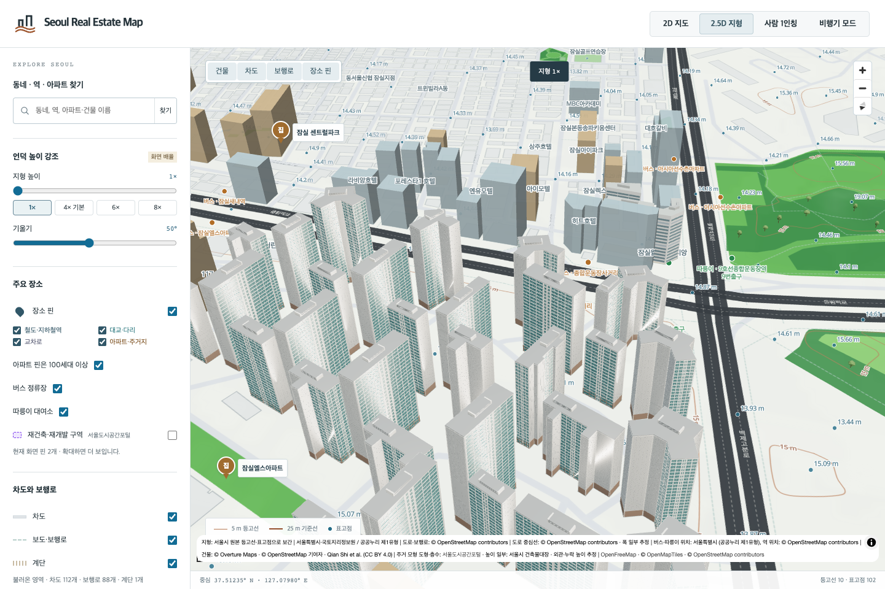
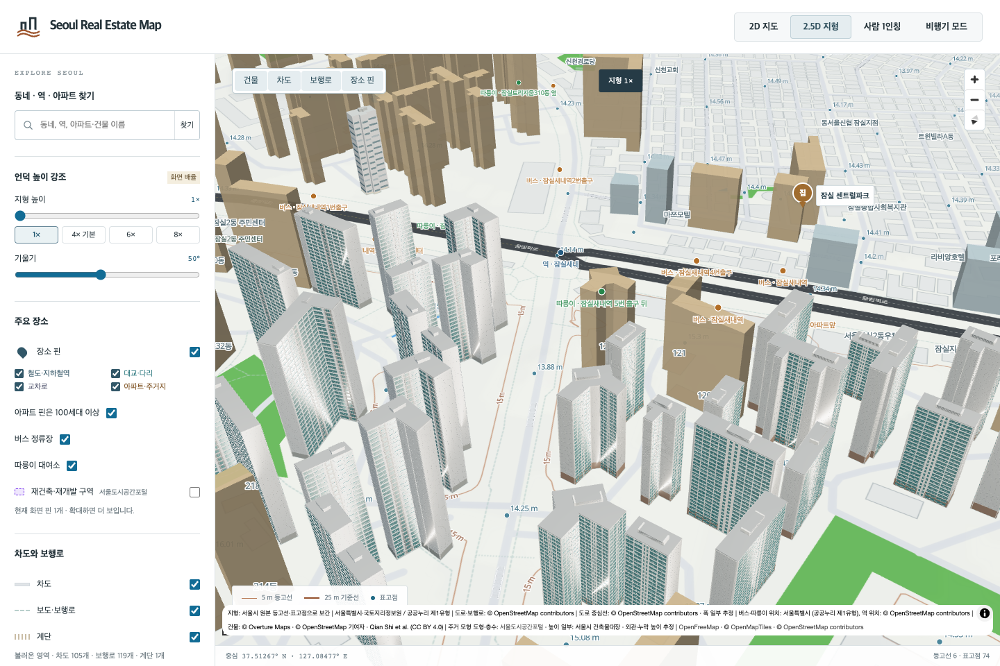
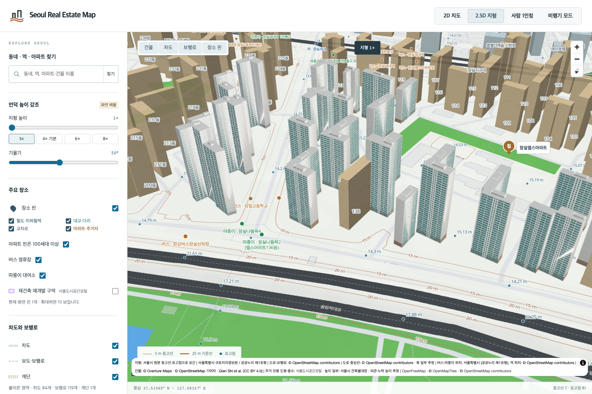

# 잠실엘스 72개 동 검토

잠실동 19·올림픽로 99의 엘스 **101–172동, 72개 동·5,678세대**를 추가했습니다. 각 동의 전체 원천 도형이 이름이 확인된 OSM 관계 6114967의 바깥 경계 안에 있고 안쪽 제외 영역과 겹치지 않습니다. 정확한 주소와 동 번호의 주건축물대장 행을 연결했습니다. [동별 출처](jamsil-els-source-identity.json)

[KB15617](https://kbland.kr/se/c/15617)의 단지 본문과 같은 객체의 사진 목록에서 완공 사진을 확인했습니다. **120동 번호는 사진 중앙 배경의 막힌 벽에 보입니다.** 전경의 발코니와 갈색 저층부는 동 번호가 보이지 않아 단지 외관으로 유추했습니다. 아이보리 기둥·수평 띠, 청록색 창, 가는 흰 난간, 중앙 서비스 창, 회색 벽 줄눈과 낮은 검은 지붕 그릴을 모델링했습니다. 나머지 71동에는 각자의 외곽·대장 높이·층수를 유지하며 이 외관을 적용했습니다.

기존 Blender MCP 세션에서 제작·렌더·독립 재로드했고 **288개 최종 방향별 화면**을 검토했습니다. GLB를 별도로 읽어 지면과 지붕 덮개, 각 동의 대장 최대높이, 외곽에서 0.298m 미만 돌출을 확인했습니다. 높이의 부분 구분 자료가 없어 전체 외곽에 대장 최대높이를 적용하는 가정은 남습니다. 분절된 면의 외관 분류도 추정이며, 125·167동의 좁은 면은 별도로 조정했습니다.

전체 72동의 2,556쌍을 검사해 **138·139동과 153·158동의 맞닿은 벽**을 확인했습니다. 낮은 동의 높이 아래에서 이웃 건물 내부로 들어가는 장식을 제거했습니다. 수정 후 실제 삼각형 면을 높이로 자르고 이웃 도형과 대조한 결과 네 방향 모두 침범이 없습니다. 꼭짓점이 모두 바깥에 있어도 면이 이웃을 관통하는 경우를 잡는 회귀 검사도 추가했습니다. [검사 구현](../../scripts/bespoke/validate_neighbor_intrusions.py)

대표 120동은 난간 10,400개를 유지하면서 완전히 가려진 내부 면만 제거했습니다. 72개 GLB 합계는 **406.87MB**입니다. 개별 난간을 유지하고 16비트 인덱스용 메시로 나누므로 용량과 호출 수 비용이 있습니다. 지도는 가까운 모형을 선별 로딩합니다.

기존 묶음의 29,471개 삼각형은 당시 생성 기록으로 바이트 단위 재현한 뒤 70개 동과 비주거 건물 2개로 분리했습니다. 기존 독립 모형인 121·122동은 원래 파일과 연결을 보존했습니다. 공유 벽의 공간 판정만으로 구분되지 않던 96개 삼각형은 원래 생성 순서의 출처 ID로 배정했고, 면·재질·속성의 보존을 비교했습니다. 옛 볼록껍질 근사의 13개 삼각형도 보존하며 새 모형의 정밀도로 주장하지 않습니다. [분리 기록](jamsil-els-generic-split.json) · [동별 대체 모형](jamsil-els-fallback-bindings.json)

브라우저에서 카메라를 이동해 72개 새 모형과 72개 대체 모형을 각각 확인했습니다. 대표 동 실패, 여러 동 혼합 실패, 120·121·122동 원본 지도 복원, 맞붙은 138동 복원 시 139동 유지, 비주거 건물 2개 보존을 검사했습니다.

[검증 기록](jamsil-els72-local-validation.json)에 자동 검사, 빌드, 직전 커밋의 기존 파일 보존 결과를 기록합니다. 이번 반영으로 서울 대상 1,417개 관리코드 중 전체 주거동 검토 완료는 **23개**입니다. 사진 원본은 로컬 조사에만 남기며 창 간격·색·방향·뒷면·지붕 치수는 실측하지 않았습니다.
