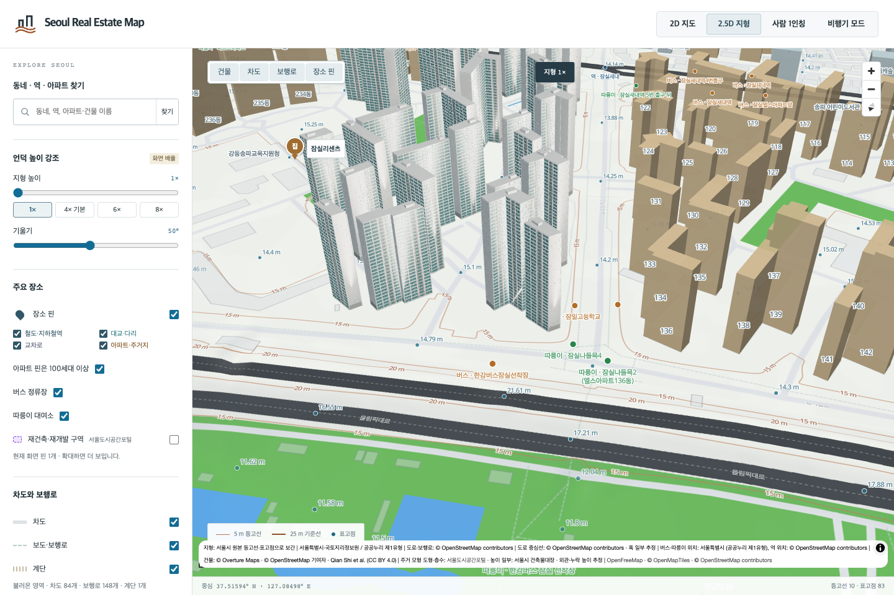
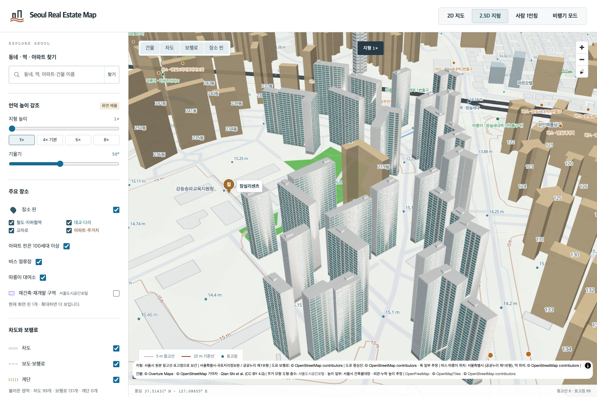
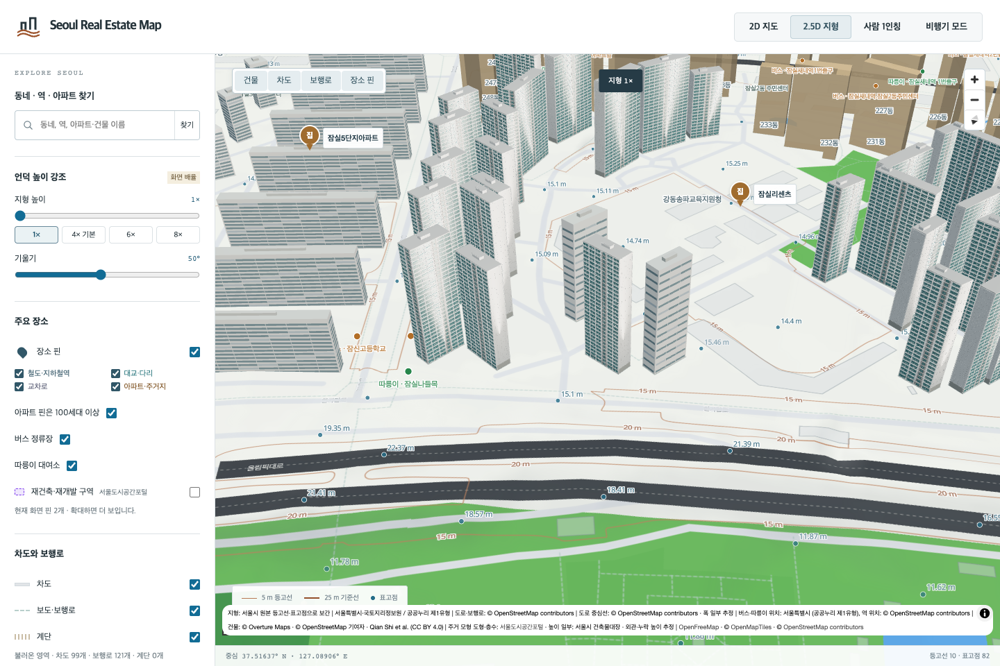

# 잠실리센츠 63개 동 검토

올림픽로 135·잠실동 22의 리센츠 201–265동 중 **263·265동을 제외한 63동**을 추가했습니다. 두 동의 원천 도형은 명명된 OSM 관계 6114968의 안쪽 제외 경계와 겹치므로 기존 모형을 유지합니다. 나머지는 전체 외곽이 경계 안에 있고, 정확한 주소·동 번호의 주건축물대장 행과 연결됩니다. [동별 출처와 제외 근거](jamsil-ricenz-source-identity.json)

[KB15524](https://kbland.kr/se/c/15524)의 본문 단지 정보와 같은 객체의 사진 목록에서 1920px 완공 사진을 확인했습니다. **218동 번호가 보이는 사진**으로 회색 막힌 벽·줄눈, 넓은 청록색 발코니 창, 흰 기둥·수평 띠와 가는 금속 난간, 중앙 서비스 창을 검토했습니다. 사진에 잘린 218동 지붕은 배경 동의 낮은 층형 구조를 참고한 추정입니다. 다른 62동에는 각자의 외곽·높이·층수를 유지하며 대표 외관을 적용했습니다.

기존 Blender MCP 세션에서 제작·렌더·독립 재로드했고 252개 최종 방향별 화면을 검토했습니다. GLB를 별도로 읽어 0m 기저, 전체 지면·지붕 덮개, 대장 최대높이와 0.298m 미만 돌출을 확인했습니다. 높은 지붕 구조는 원천 외곽 안에 있습니다. 부분 높이 자료가 없어 각 동의 전체 외곽에 대장 최대높이를 적용하는 가정은 남습니다.

대표 218동은 난간 12,180개의 위치·수·간격을 유지하면서 내부에 완전히 가려진 면만 제거했습니다. GLB는 12.92MB에서 9.29MB로 약 28.1% 줄었습니다. 전후 네 방향 렌더와 삼각형·속성을 비교했습니다. 16비트 인덱스를 쓰도록 나눈 대신 메시 수가 늘어나는 절충이 있으며, 대표와 나머지 62동의 GLB 합계는 약 351.22MB입니다. 지도는 가까운 모형을 선별 로딩합니다.

기존 두 묶음의 28,450개 삼각형을 당시 생성 기록으로 바이트 단위 재현한 뒤 동별로 분리했습니다. 잘못 잠실5단지에 묶여 있던 리센츠 동도 바로잡고, 제외한 263·265동을 포함한 나머지 22개 건물 외곽은 보존합니다. 옛 볼록껍질 근사의 76개 삼각형도 그대로 남기며 새 모형의 정밀도로 주장하지 않습니다. [분리 기록](jamsil-ricenz-generic-split.json) · [동별 대체 모형](jamsil-ricenz-fallback-bindings.json)

브라우저에서 카메라를 이동하며 63개 새 모형과 63개 대체 모형의 표시를 각각 확인했습니다. 대표 동 실패, 201·218·241동 혼합 실패, 218동의 새 모형·대체 모형 동시 실패 시 원본 지도 복원, 263·265동 보존도 검사했습니다. 지도 외곽 필터가 화면에 반영된 뒤 중복 표시 여부를 확인합니다.

[검증 기록](jamsil-ricenz63-local-validation.json): Node 13,801개, 관련 Python 44개, 브라우저 6개와 빌드 통과. 직전 `4ba6e6f69`의 bespoke 236개·reference 125개·generic 13,607개 기록, 이전 수정 17건, GLB/Blender 113,786개 파일은 보존했습니다.

공식 65동 중 63동만 검토되었으므로 리센츠는 부분 완료입니다. KB 5,563세대와 대장 65행 합계 5,562세대의 차이는 해결하지 않았으며 이번 63동의 대장 합계는 5,456세대입니다. 서울 대상 1,417개 관리코드 중 전체 주거동 검토 완료는 22개입니다. 사진 원본은 로컬 조사에만 남깁니다. 창 간격·색·방향·뒷면·지붕 치수는 실측하지 않았습니다.
