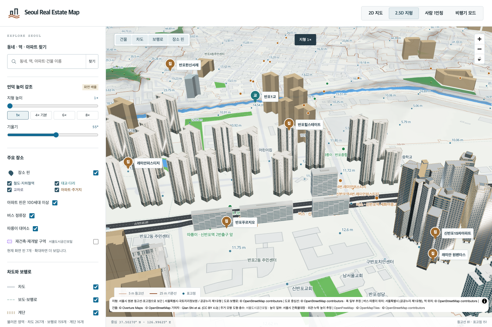
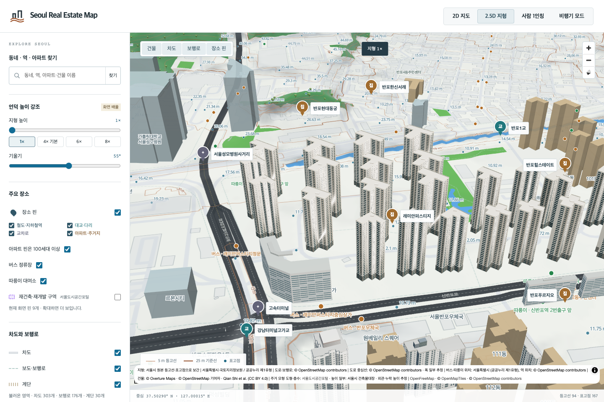

# 래미안퍼스티지 28개 동 검토

반포동18-1·반포대로275의 101–128동을 각각의 원천 도형과 건축물대장 높이로 제작했습니다. 28동의 세대수 합은2,444입니다. 기존 Blender MCP9876/9878 세션에서 제작했으며 새 Blender 프로세스를 실행하지 않았습니다.

## 외관과 추정 범위

[KB 단지 페이지](https://kbland.kr/se/c/21363)에 연결된 두 완공 사진을 직접 검토했습니다. 밝은 아이보리 벽, 짙은 세로 창 묶음, 갈색 저층부, 옥탑 장식을126동 대표 모델에 적용했습니다. 유리 면적이 과했던 첫 시안은 제외하고 벽과 창의 비율을 수정한 v2를 게시했습니다. 나머지27동은 검토한 대표 외관을 각 동의 독립된 외곽·층수·높이에 적용한 `representative-photo-inference`입니다.

사진에서 개별 동 번호와 촬영 방향은 확인하지 못했습니다. 자료에는 내부 날개별 높이도 없어 각 동의 최대 높이를 균일하게 적용했습니다. 모든 면·조경·내부 날개 높이를 실측한 모델은 아닙니다. 원본 사진은 로컬 검토 자료에만 있으며 공개 파일이나 모델 텍스처에 포함하지 않았습니다.

101–128동 모두 정면·반대편·측면·상부 렌더112장을 독립 검토했습니다. GLB의 실제 지면 삼각형이 원천 외곽과 일치하는지, 지붕이 빠짐없이 덮이는지, 최대 높이가 대장값인지도 별도 검사했습니다.

## 위치와 높이

[원천 식별 기록](raemian-prestige-source-identity.json)은 이름이 붙은 OSM 단지 경계305066918 안에 전체 도형이 포함되는 동 번호를 추출하고, 동일한 대지·도로명주소의 주건축물 대장 행과 연결합니다. 동 번호마다 후보가 하나임을 독립 재조회했습니다. OSM 경계는 지적도나 공인 측량 경계가 아닙니다. 115동의 별도 부속건축물 행은 주거동으로 세지 않았습니다.

대장 높이는 실제로 기록된 수치이나 옥탑의 법정 산정 기준이나 모든 면의 층고가 검증되었다는 의미는 아닙니다. OSM 높이는 별도 필드로 보존합니다.

| 동 | 대장 층수 | 대장 높이 m | OSM 높이 m | 세대수 |
| --- | ---: | ---: | ---: | ---: |
| 101 | 28 | 79.3 | 79.0 | 79 |
| 102 | 31 | 87.7 | 88.0 | 85 |
| 103 | 26 | 73.7 | 74.0 | 102 |
| 104 | 30 | 84.9 | 85.0 | 118 |
| 105 | 30 | 84.9 | 85.0 | 118 |
| 106 | 30 | 84.9 | 85.0 | 118 |
| 107 | 30 | 84.9 | 85.0 | 87 |
| 108 | 31 | 87.7 | 88.0 | 91 |
| 109 | 31 | 87.7 | 88.0 | 91 |
| 110 | 28 | 79.3 | 79.0 | 79 |
| 111 | 32 | 90.5 | 90.0 | 94 |
| 112 | 31 | 87.7 | 88.0 | 88 |
| 113 | 31 | 87.7 | 88.0 | 90 |
| 114 | 31 | 87.7 | 88.0 | 90 |
| 115 | 29 | 82.1 | 82.0 | 83 |
| 116 | 31 | 87.7 | 88.0 | 90 |
| 117 | 28 | 79.3 | 79.0 | 76 |
| 118 | 29 | 82.1 | 82.0 | 79 |
| 119 | 30 | 84.9 | 85.0 | 88 |
| 120 | 32 | 90.5 | 90.0 | 92 |
| 121 | 26 | 73.7 | 74.0 | 76 |
| 122 | 26 | 73.7 | 74.0 | 76 |
| 123 | 26 | 73.7 | 74.0 | 76 |
| 124 | 28 | 79.3 | 79.0 | 76 |
| 125 | 29 | 82.1 | 82.0 | 114 |
| 126 | 23 | 65.3 | 65.0 | 44 |
| 127 | 29 | 79.3 | 79.0 | 56 |
| 128 | 31 | 87.7 | 88.0 | 88 |

## 기존 모델과 오류 복구

[28동 교체 연결](prestige-fallback-bindings.json)에 따라 자기 동의 원천 도형만 교체합니다.

- 기존 주 단지 모델의12,957개 삼각형은21개 동11,703개와 상가2동1,254개로 분리했습니다.
- 반포푸르지오 이름 아래 묶였던1,732개 삼각형은 퍼스티지103동572개와 푸르지오3개 건물1,160개로 분리했습니다.
- 101·124·127·128동의 독립 모델 및 앞선 원펜타스 분리 작업의126동 대체 모델은 보존합니다.
- 신반포15차로 잘못 표기된125동은 원래 GLB·좌표·해시를 유지하고 모델 식별 정보만 수정합니다. 별도 지도 핀 자료까지 고친 것은 아닙니다.
- 기존 GLB를 원래 제작 코드로 바이트 단위 재생성한 후 삼각형별 소유 도형을 대조했습니다. 원본의242개 삼각형에는 오목한 외곽을 넘는 이전 볼록껍질 근사가 있으며, 이 분리 작업에서는 원래 형태를 보존했습니다. 자세한 한계와 도형별 증거는[주 단지 분리 감사](prestige-main-generic-split.json)에 기록했습니다.

`metadata-only` 수정은 같은ID·같은 원천 도형 하나에 한정합니다. 이름·관리코드·세대수·출처 식별값 외의 속성은 모두 같아야 하며, 렌더링 값 변경이나 중복 수정은 거부합니다.

서쪽11동·동쪽17동의 정상 표시, 선택한 모델 실패,103·125동의 모델과 대체 모델 동시 실패, 동쪽17동 전체 모델 실패를 실제 브라우저로 확인했습니다. 새 모델이 실패하면 기존 동별 모델로, 둘 다 실패하면 원본 지도 도형으로 복구합니다. 남겨둔 상가2동과 푸르지오3개 건물도 계속 표시됩니다.

[검증 기록](raemian-prestige-all28-local-validation.json). 이 기록의 완료는 해당28개 주거동의 검토 범위이며 서울 전체 완료나 배포 완료를 뜻하지 않습니다.
