# 대표 아파트 batch05 — 사진 기반 근사 모델

7개 단지, retained source polygon 88개. `coarse-visually-reviewed`, `completionCredit=false`. 정밀 bespoke 완성 실적에 포함하지 않는다.

기준 브랜치: `feat/apartment-representatives-03` (`74c2d6c6584d8131721f4d4f6c8f6cd386a5cf82`). 최신 main `a89732cf8bf4ac8ec18501917250f162f6ea6cc9` 및 현재 기준 브랜치의 bespoke/reference/representative 소유권과 중복 없음. 기존 자산·PR·main은 수정하지 않았다.

## 단지별 실제 범위

| 단지 | 원본 폴리곤 | 높이 기준 | GLB bytes | draw calls |
|---|---:|---|---:|---:|
| 성북동아에코빌 (A13612002) | 15 | 원본 height_m | 1529280 | 5 |
| 마곡13단지 힐스테이트마스터 아파트 (A10026879) | 22 | 원본 height_m | 1725896 | 5 |
| 마곡엠밸리15단지 (A15728011) | 13 | 원본 height_m | 1944220 | 6 |
| 수서신동아 (A13522006) | 8 | 원본 층수 × 3m, 8개 | 530576 | 5 |
| 광장현대3단지아파트 (A14381415) | 10 | 원본 층수 × 3m, 10개 | 965884 | 6 |
| 등촌주공5단지 (A15703309) | 9 | 원본 층수 × 3m, 9개 | 581660 | 5 |
| 청계현대아파트 (A13381608) | 11 | 원본 height_m | 1442512 | 6 |

공식 동 수와 원본 폴리곤 수가 같아도 동별 신원이 확인된 것은 아니다. 원본 배치·방향·외곽·높이는 유지하며 단지별 1–2개 대표 입면을 반복한다. 높이값이 있는 61개는 유지하고, 없는 27개는 원본 층수 × 3m로 추정했다. 단지 지형과 동별 지반고, 실제 옥상 기계실 높이는 미검증이다. 원본 준비 단계에서 구멍·누락 폴리곤은 sourceIssues로 거르며 선택한 7개는 sourceIssues가 없고 전체 footprint ID와 일치한다.

## 사진과 렌더 비교

### 성북동아에코빌

두 시점의 청회색 창 격자와 흰 수평선은 사진의 발코니 입면을 단순화한다. 초기 창열을 줄여 밀도를 조정했다. 실제의 넓은 수직 코어와 발코니별 돌출 깊이는 생략했다.

사진 출처: https://cdnweb01.wikitree.co.kr/webdata/editor/202407/22/img_20240722134013_e33dabf6.webp
원문 출처: https://www.wikitree.co.kr/articles/969113
사진 SHA256: `430e4b7264ac7e281dc764e4b8ed4a8ece1f25f0443b60ff17ac47a09607ac12`

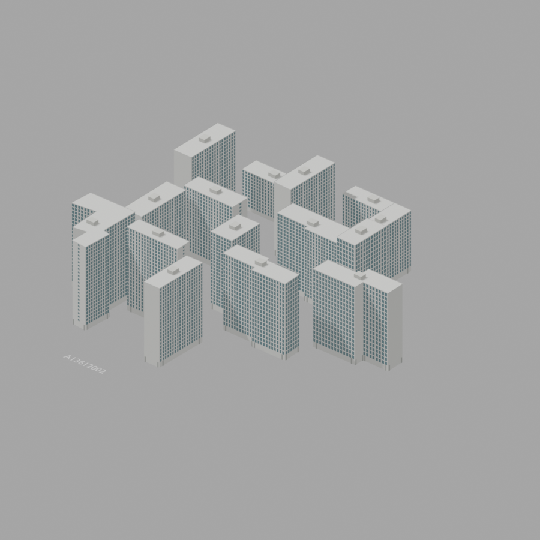
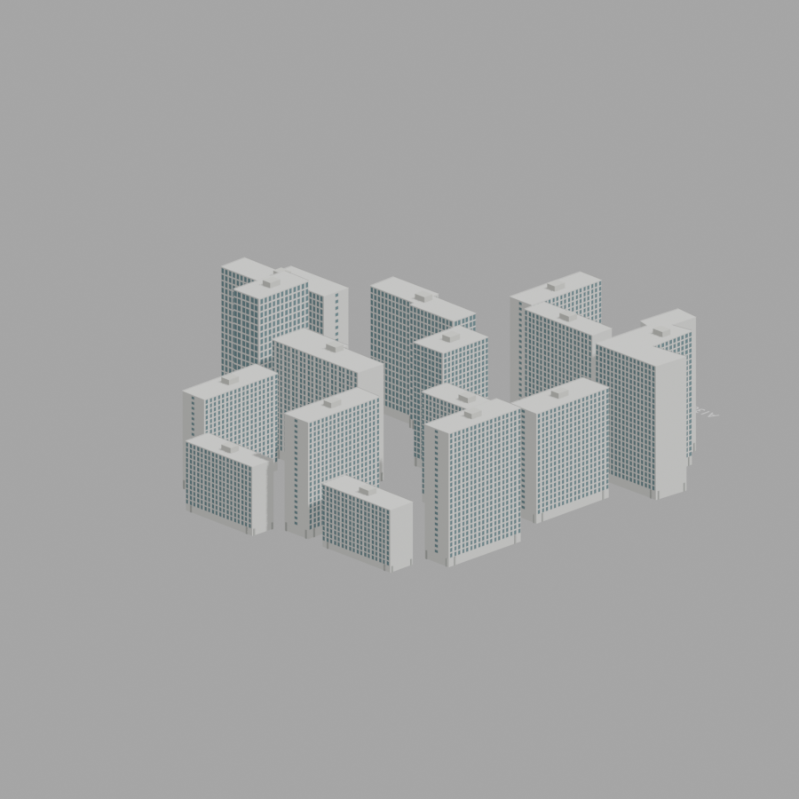

### 마곡13단지 힐스테이트마스터 아파트

두 시점에 크림색 판상·소형 동과 좁은 창열을 확인했다. 사진의 낮은 옥상선과 밝은 측벽을 적용했다. 갈색 세로 구획은 사진보다 약하며, 1313/1314를 특정 폴리곤에 대응시킨 것은 아니다.

사진 출처: https://file.kbland.kr/image/kbstar/land/img/revw/userseq/1188003/20220210/ODViYmRhY2UwM2VmYjJiMDcy.jpg
원문 출처: https://kbland.kr/se/c/30363
사진 SHA256: `5840c9504a854c078c5ad9d92da64346bb5eada5780a6519cd5abb98c8247092`

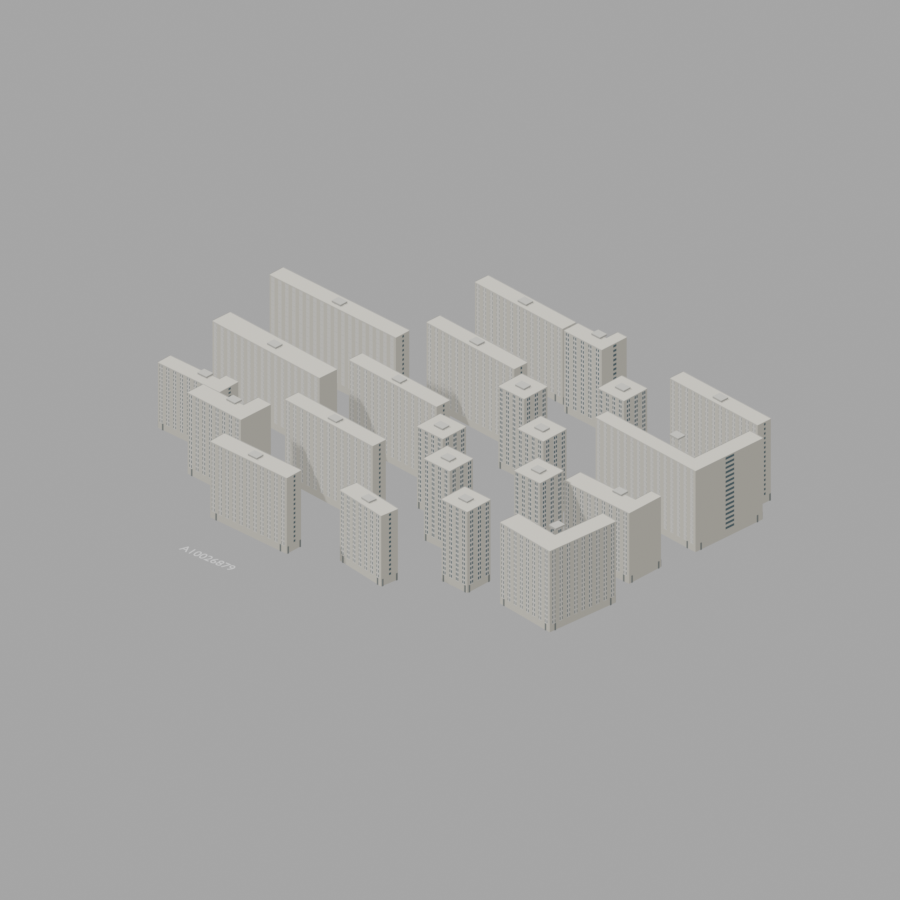
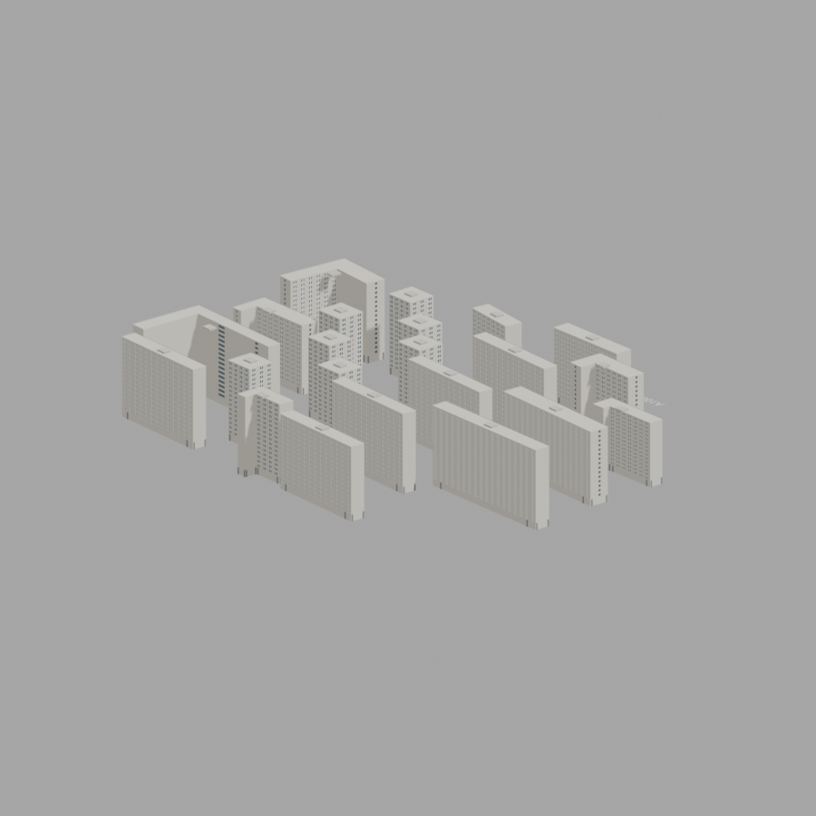

### 마곡엠밸리15단지

두 시점에서 원본 꺾인 평면과 회색·청색 세로 구획을 확인했다. 사진의 1513 측벽, 청색 띠와 어두운 하층부를 대표 처리했다. 청색 띠 위치와 난간은 동별 실측 대응이 아니다.

사진 출처: https://file.kbland.kr/image/kbstar/land/img/revw/userseq/3830655/20240827/3879688f429b7cef.jpeg
원문 출처: https://kbland.kr/se/otd/1467272
사진 SHA256: `0c2d3f5f1e8ae640616b307b218982f795bd72ba73fcf46c0e813a443bd79a8d`

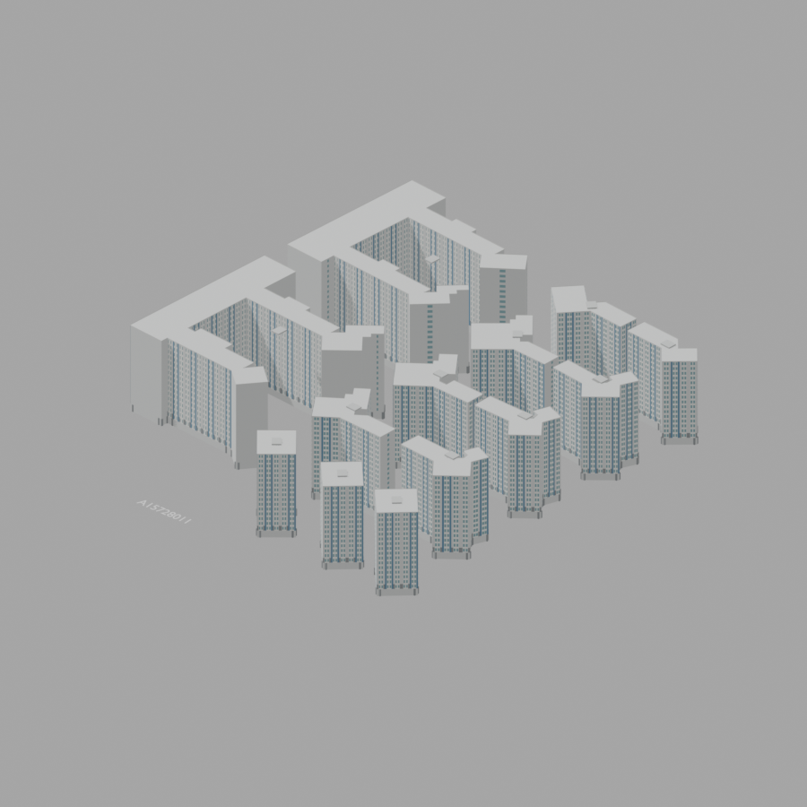
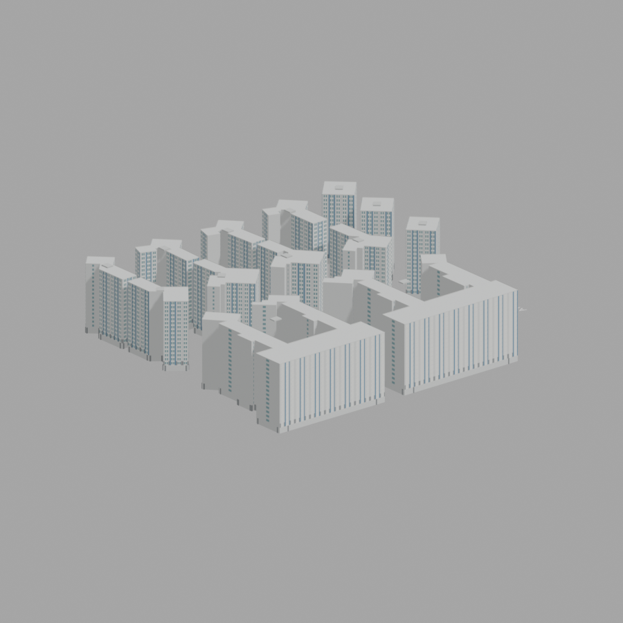

### 수서신동아

양쪽 시점에서 흰 장방형 동과 수평 복도 띠 및 반대면 창열을 확인했다. 사진의 개방 복도는 평면의 어두운 띠로 근사했다. 각 동의 복도 방향과 필로티는 검증하지 않았다.

사진 출처: https://dimg.donga.com/ugc/CDB/WEEKLY/Article/65/a9/c7/31/65a9c7311cc4d2738250.jpg
원문 출처: https://weekly.donga.com/economy/article/all/11/4693231/1
사진 SHA256: `1a8da3d05c8877111f8302e7e1a1334697b7ae7e28e59c1a5a32454394504469`

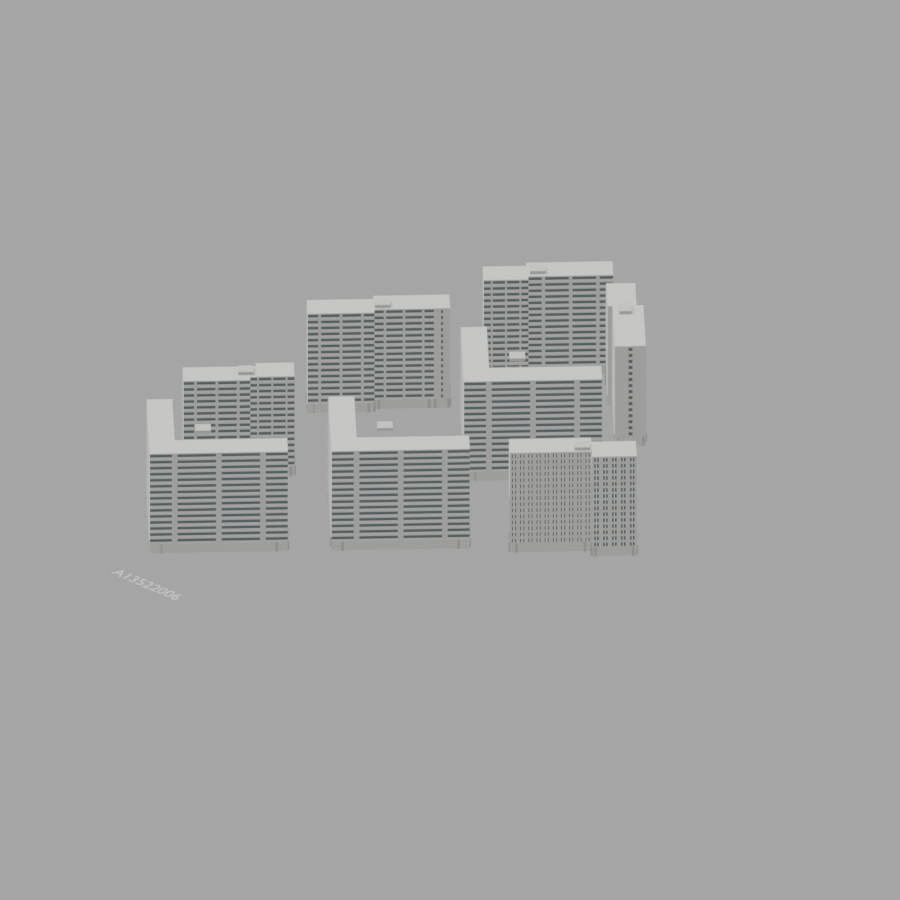
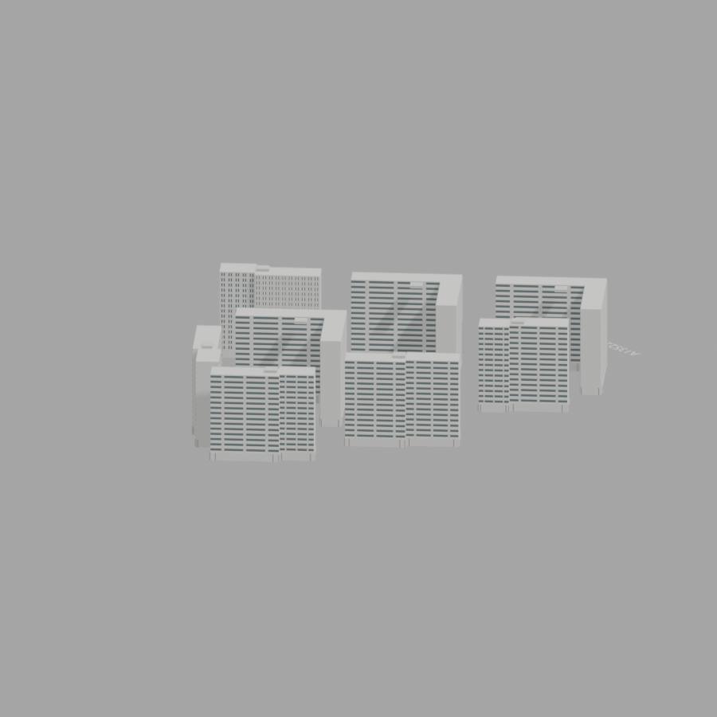

### 광장현대3단지아파트

사진보다 과했던 붉은 면을 줄인 뒤 양쪽 시점에서 밝은 벽과 붉은 세로 창 하부 띠를 확인했다. 사진의 측벽 골과 계단 코어의 경사진 옥상은 생략했다. 원본에 동 이름이 없어 동별 신원은 미확인이다.

사진 출처: https://aptimage.r114.co.kr/img/01/06/0106_413.jpg
원문 출처: https://m.r114.com/?ComplexCd=A01061432100013&ComplexNm=&CortarNo=&_a=detail&_c=memul&_m=complex&mmCode=A01012
사진 SHA256: `f40027ed8c54b4a0690dbc0417bed4463cfdf65c51a224c056fb440e5dc36ce6`

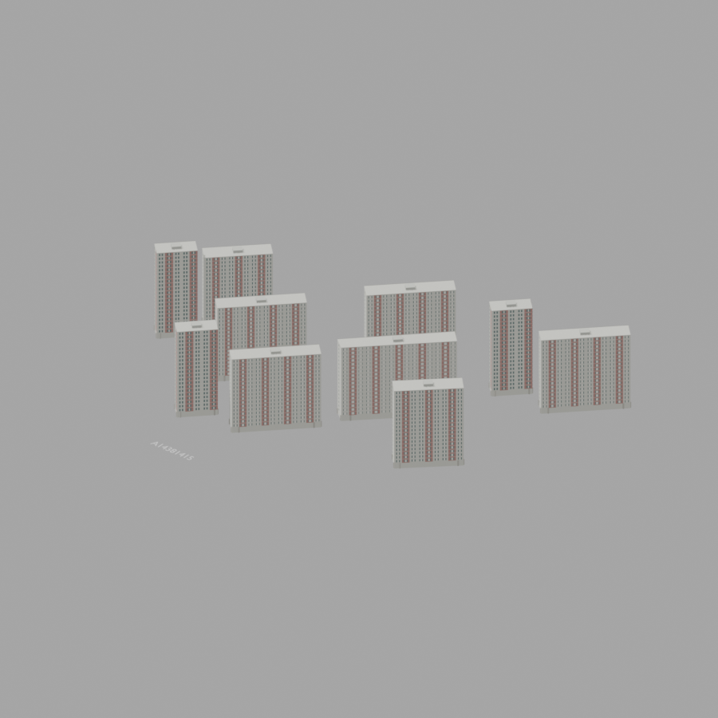
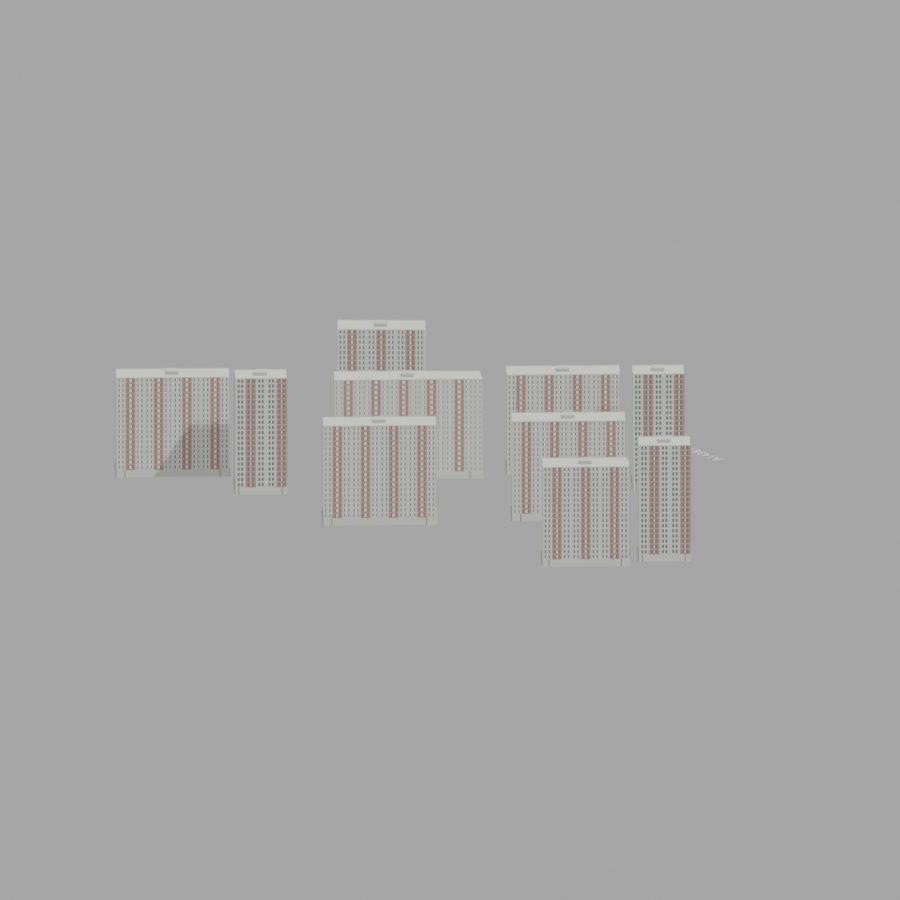

### 등촌주공5단지

두 시점에 흰 판상동, 긴 수평 복도 띠와 좁은 측벽을 확인했다. 사진의 503/504 저층부 도색과 옥상 안테나는 세부 재현하지 않았다. 503/504의 개별 위치를 사진으로 확정하지 않았다.

사진 출처: https://news.nateimg.co.kr/orgImg/se/2021/03/27/22JZ07P2ZZ_1.jpg
원문 출처: https://news.nate.com/view/20210327n10160
사진 SHA256: `1cc04c8557eb17e33063bb54632ea973f49eca9556bd9a9aab3bd69f5f8f5bcd`

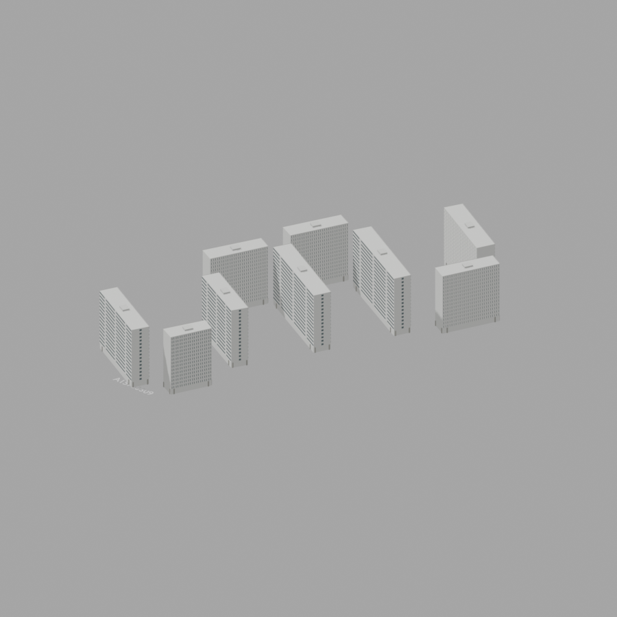
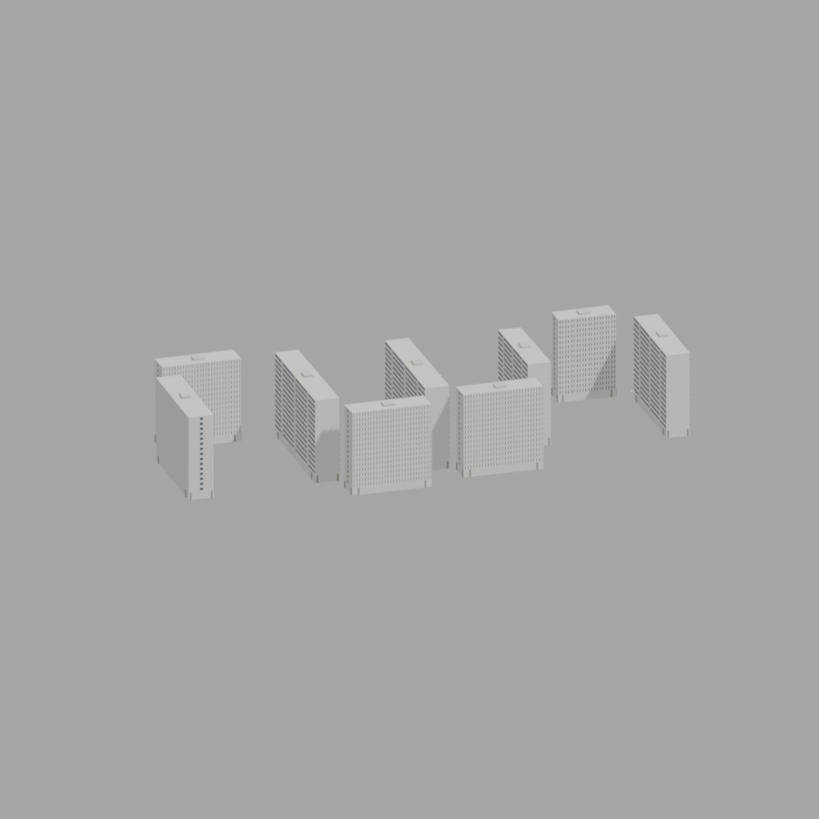

### 청계현대아파트

유리 비중을 낮춘 뒤 두 시점에서 흰 입면과 어두운 무창 측벽을 확인했다. 사진의 104 측벽 대비를 반영했지만 긴 수평창은 작은 반복 창으로 단순화되어 있다. 돌출 계단실 및 동별 신원은 미확인이다.

사진 출처: https://news.nateimg.co.kr/orgImg/se/2025/07/13/2GVC1IZY46_6.jpg
원문 출처: https://news.nate.com/view/20250713n05829
사진 SHA256: `ca019521228cf00cd6b4f44e4f14c6c58d654b51459211e5b67eade0976a4704`

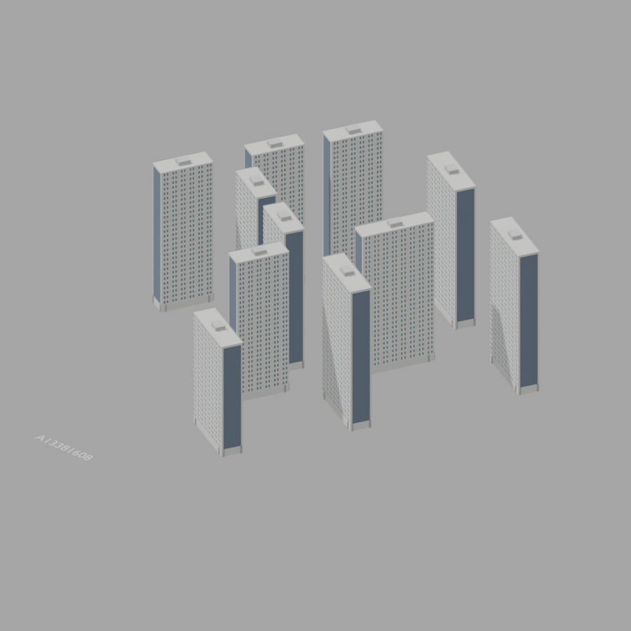
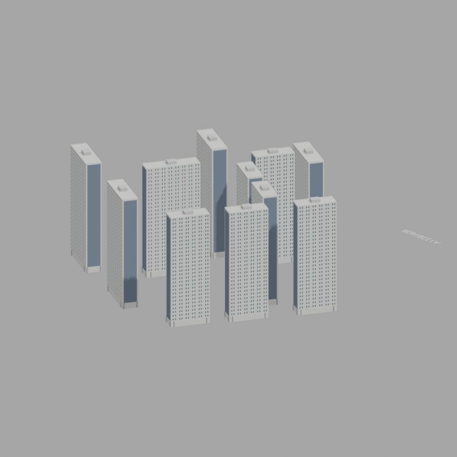

## 보류 및 검증

직접 확인할 사진이 남지 않은 17개 단지는 integrationHold=true로 제외했다. 모델이나 완료 수를 추가하지 않았다.

- 금호두산 (A13380703): No exact-name source with a verified direct exterior image was retained in the bounded search.
- 독산주공13단지 (A15383308): Search returned insufficient exact-name evidence for a direct exterior image.
- 광장현대파크빌 (A14381516): No exact-name direct image retained; nearby Gwangjang Hyundai results were not accepted as this complex.
- 대림현대3차 (A15081107): No exact-name source with verified direct image retained.
- 신금호파크자이아파트 (A10027602): Search results did not yield a retained exact-name direct exterior image.
- 월계청백1단지 (A13985106): No retained exact-name direct image.
- 삼성힐스테이트1단지 (A13509012): No retained exact-name direct image.
- 힐스테이트뉴포레 (A10023661): No retained exact-name direct image.
- 신내건영2차아파트 (A13185607): No retained exact-name direct image.
- 신도림동아1차 (A15288813): No retained exact-name direct image.
- 청량리미주 (A13086705): No retained exact-name direct image.
- 서초힐스 (A13778204): No retained exact-name direct image.
- 사당우성2단지 (A15681502): Search returned a listing result, but no direct image was downloaded and independently confirmed within the bounded attempts.
- 서초포레스타2단지아파트 (A10028021): Direct image download attempt failed with a write/transfer error; no usable local image retained.
- 브라운스톤돈암 (A13606201): No retained exact-name direct image.
- 강동 리버스트 7단지 아파트 (A10024421): Search result described Riverst Gangdong but no local direct image was retained; no facade traits inferred from text.
- 래미안강남힐즈 (A13520003): Exact-name listing result found, but local direct image was not retained; no facade traits inferred from search text.

- 실제 BlenderMCP 9885에서 생성·검증; MCP 기록과 원본 352개 개별 mesh/source ID를 보존했다.
- 셸 외곽 오차 <1mm, 원본 또는 추정 높이 오차 <1cm 검사를 통과했다. 창은 평면 메시이며 숨겨진 창 박스 프리즘을 만들지 않았다.
- GLB는 재질별 합쳐 5–6 draw calls. 편집용 blend 및 자체 완결 입력·생성·검증 스크립트는 modeling/representative/representative-batch05에 보존한다.
- 사진은 배포하지 않는다. 출처 URL 및 SHA256만 배포한다.
- `node scripts/validate_representative_models.mjs`: 전체 24개 대표 자산 / 348개 source footprints 통과(이번 배치만 7개 / 88개).
- `node --experimental-strip-types --test tests/representative-models.test.mjs`: 2개 통과; 로드 실패·미표시 시 generic fallback 포함.
- `python3 -m unittest discover -s tests -p test_representative_publisher.py`: 2개 통과.
- Merge/deploy 및 정밀 완료 통계 수정 없음.
