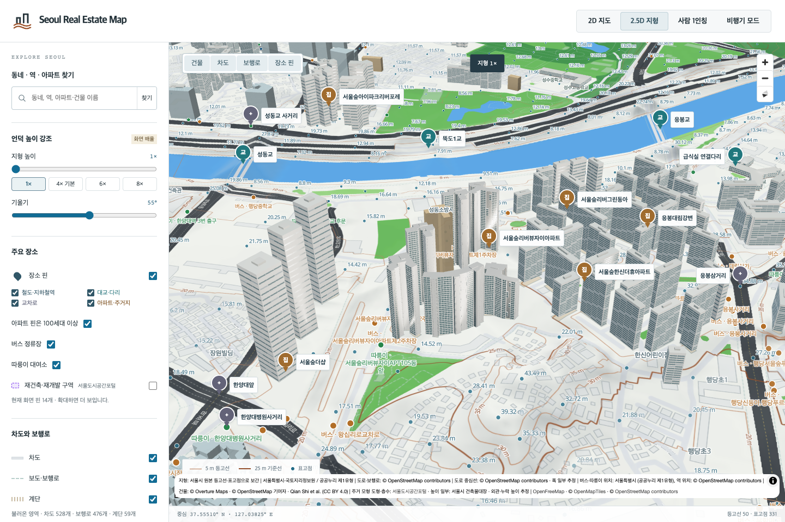
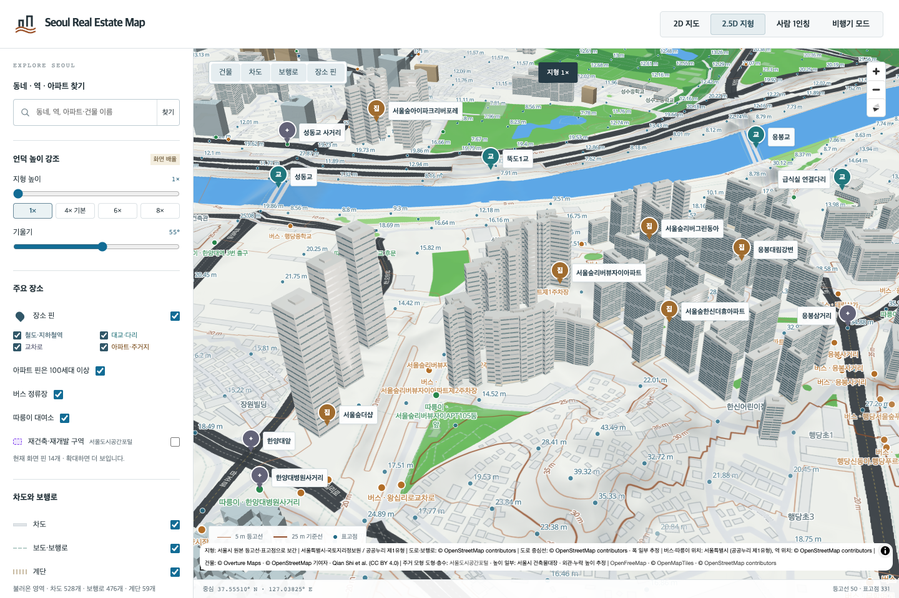

# 서울숲리버뷰자이 7개 동 검토

고산자로2길 65·행당동 380의 서울숲리버뷰자이 101–107동, 1,034세대입니다. 명명된 OSM 경계 472826085 안의 동별 원천 도형과 정확한 주소·동 번호의 주건축물대장 행을 독립 대조했습니다. [동별 출처](seoulforest-riverview-xi-source-identity.json)

[KB31867](https://kbland.kr/se/c/31867) 본문 데이터의 같은 객체에서 단지 정보와 사진 목록의 1920px 완공 사진을 확인했습니다. 사진의 **104동 번호가 보입니다**. 넓은 흰 기둥·수평 띠, 청록색 창, 회색 막힌 벽과 줄눈을 반영하고, 중앙 홈과 엇갈린 네 구간의 박스형 볼륨을 실제 입체로 만들었습니다. 104동은 최초 검토 후 창 면적을 줄이고 흰 골격을 넓힌 v2입니다.

나머지 6동에는 각자의 원천 도형·높이·층수를 보존하면서 대표 외관을 적용했습니다. 각 동에서 충분히 긴 벽을 선택하고, 안쪽 홈이 도형 안에 들어가며 몸체를 끊지 않는지 검사했습니다. 104동의 벽 번호를 다른 동에 그대로 복사하지 않았습니다. 모든 동은 기존 Blender MCP에서 제작·렌더·독립 재로드했고 총 28방향의 최종 화면을 검토했습니다. 106·107동 지붕 시점의 잘림은 카메라를 고쳐 다시 렌더했습니다.

GLB 삼각형을 별도로 읽어 전체 지면·지붕 면, 대장 높이, 0m 기저, 최대 0.241m 미만 돌출과 지붕 구조의 원천 도형 내부 포함을 확인했습니다. 중앙 홈은 표면 색만 바꾼 것이 아니며 광선 교차 검사로 열린 구간과 박스 구간을 구분합니다. 부분 높이 자료가 없어 각 동 전체 외곽에 대장 최대높이를 적용한 가정은 남아 있습니다. 방향·뒷면·창 간격·색·지붕 및 홈 치수도 실측하지 않았습니다.

기존 묶음의 8,017개 삼각형을 당시 생성 과정과 바이트 단위로 재현한 뒤 원래 건물별로 나눴습니다. 기존 볼록껍질 근사 10개 삼각형과 최대 1.497m 돌출은 대체 모델에 그대로 보존하며 새 모델의 정밀도로 주장하지 않습니다. [분리 기록](seoulforest-riverview-xi-generic-split.json) · [동별 대체 모델](seoulforest-riverview-xi-fallback-bindings.json)

브라우저에서 정상 표시, 대표 104동 실패, 102·106동 혼합 실패, 103동의 새 모델·대체 모델 동시 실패 시 원본 지도 복원, 7동 전체 대체 모델을 확인했습니다.

[검증 기록](seoulforest-riverview-xi7-local-validation.json): Node 13,797개, 관련 Python 43개, 브라우저 5개와 빌드 통과. 직전 ed3a96c78의 bespoke 229개·reference 125개·generic 13,607개 기록, 기존 수정 16건과 GLB/Blender 113,765개 파일을 보존했습니다. 현재 공식 관리코드 1,417개 중 22개가 검토 기준을 충족하며 서울 전체 완료는 아닙니다. 원본 사진은 로컬 조사에만 남깁니다.
