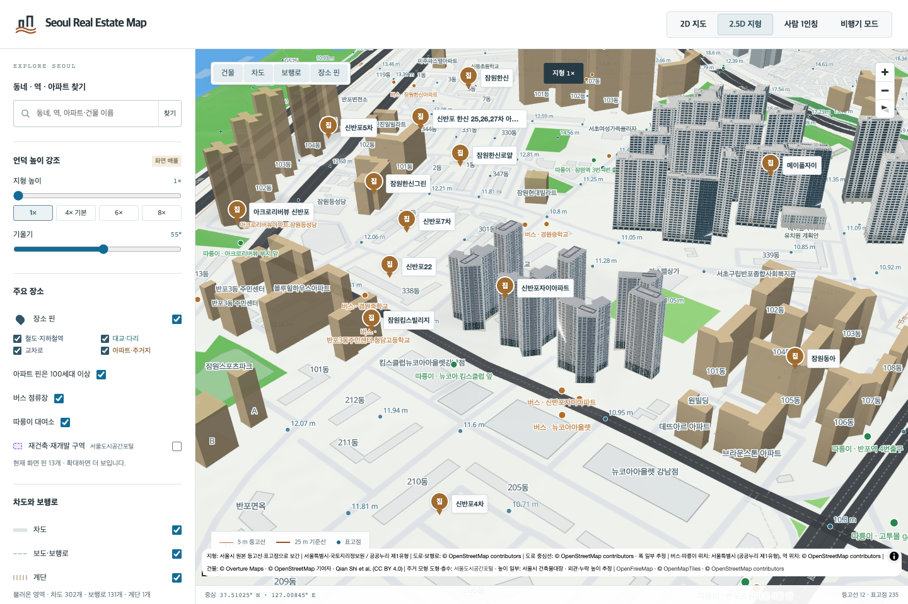
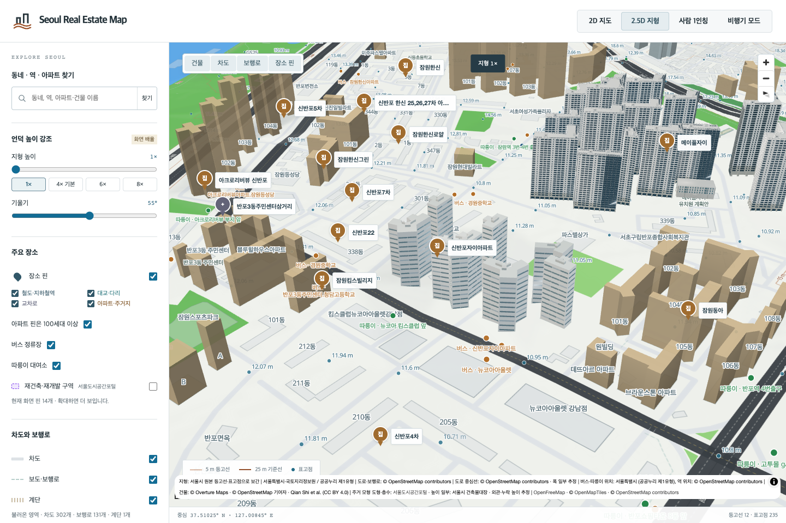

# 신반포자이 7개 동 검토

잠원로60·잠원동160의 신반포자이101–107동,607세대입니다. 이름이 비슷한 반포자이와 구분합니다. 명명된 OSM경계414371716 안의 원천 도형7개와 정확한 주소·동 번호의 주건축물대장 행을 독립 대조했습니다. [동별 출처](shinbanpo-xi-source-identity.json)

2018년 [매일경제 단지 기사](https://v.daum.net/v/20180705173607240)의 첫 외관 사진을 검토했습니다. 다른 두 이미지는 서비스 안내이며 외관 근거로 사용하지 않았습니다. 별도 KB페이지의 추천 단지 사진도 제외했습니다.101동 대표 모델의 흰 기둥과 금속 벽면 비중, 창 면적, 지붕 프레임을 사진 대조 후 수정했습니다. 나머지6동은 이 외관을 각각의 원천 윤곽·대장 높이·층수에 적용했습니다.

실제 Blender MCP로 제작·렌더하고, 각 파일을 독립 재로드했습니다. 정면·반대편·측면·지붕 총28장을 직접 검토했습니다. GLB삼각형을 별도로 읽어 지면 외곽과 지붕 면의 누락,0m기저,대장 최대높이,전체 돌출0.5m미만,지붕 구조의 원천 도형 내부 포함을 검사했습니다. 부분 높이 자료가 없어 전체 외곽을 최대 높이로 올린 가정은 남습니다. 사진 속 동 번호와 촬영 방향, 도로변3동의 정확한 번호, 색·창 배치·뒷면·지붕 치수는 확정하지 않았습니다.

기존7동 묶음은3,861개 원본 삼각형의 위치·속성·재질·개수를 그대로 보존해 동별 대체 모델로 나눴습니다. 원본의 볼록껍질 근사101삼각형과 최대5.141m돌출은 과거 대체 모델에 그대로 남으며 새 모델의 정밀도로 주장하지 않습니다. 단일 모델 실패가 다른6동을 가리지 않습니다. [분리 근거](shinbanpo-xi-generic-split.json)

브라우저에서 정상 표시,101대표 실패,102·105혼합 실패,106새 모형과 대체 모형 동시 실패 시 원본 도형 복원,7동 전체 대체 모형 복원을 확인했습니다. 각 경우 주변6개 건물 그룹도 모델 또는 원본 지도 도형으로 남았습니다. 높이가 없는 경원중학교·신반포7차 일부는 기존대로 지면 윤곽으로 표시합니다.

[검증 기록](shinbanpo-xi7-local-validation.json): Node13,787개,관련Python40개,브라우저5개,빌드 통과. 직전470626b의208bespoke·125reference·13,607generic기록,이전수정12건,113,702GLB/Blender파일 보존을 대조했습니다. 서울 전체는1,417관리코드 중19개가 현재 검토 기준을 충족합니다. 모든 서울 단지가 완료된 것은 아닙니다. 원본 사진은 로컬 조사에만 보관했습니다.
