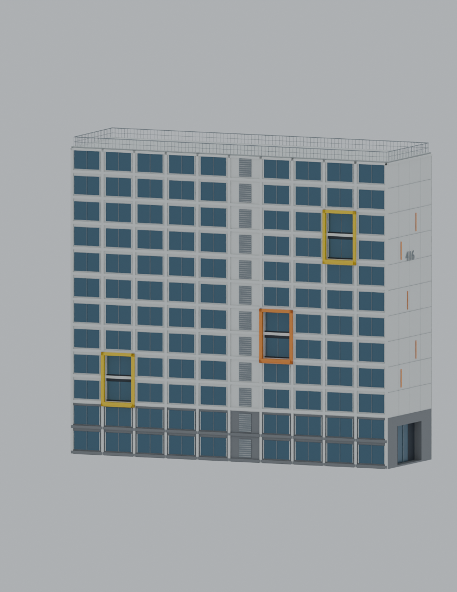
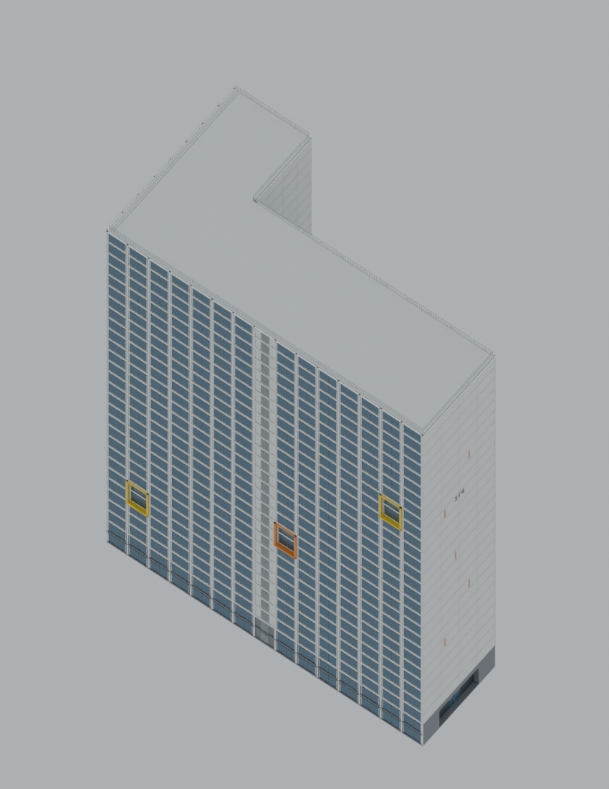
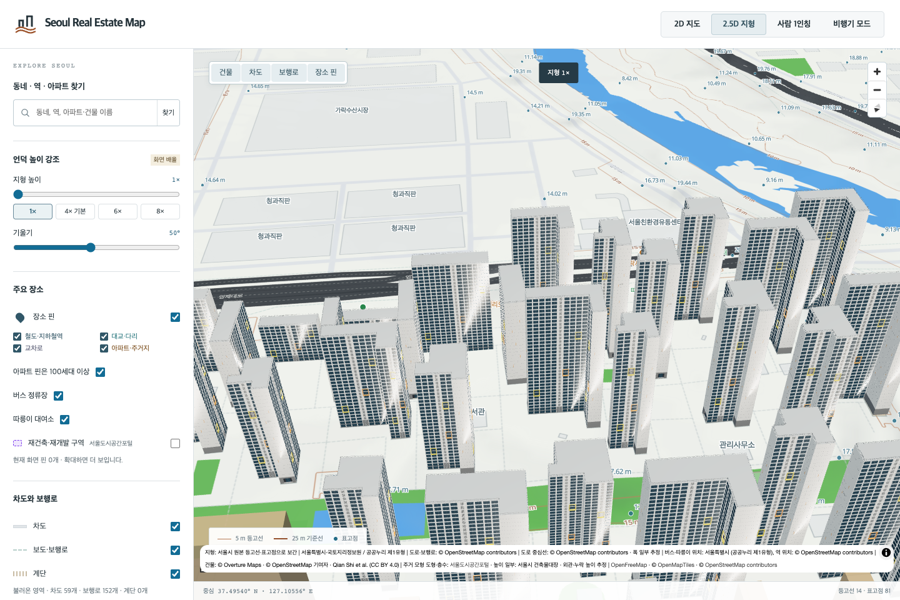
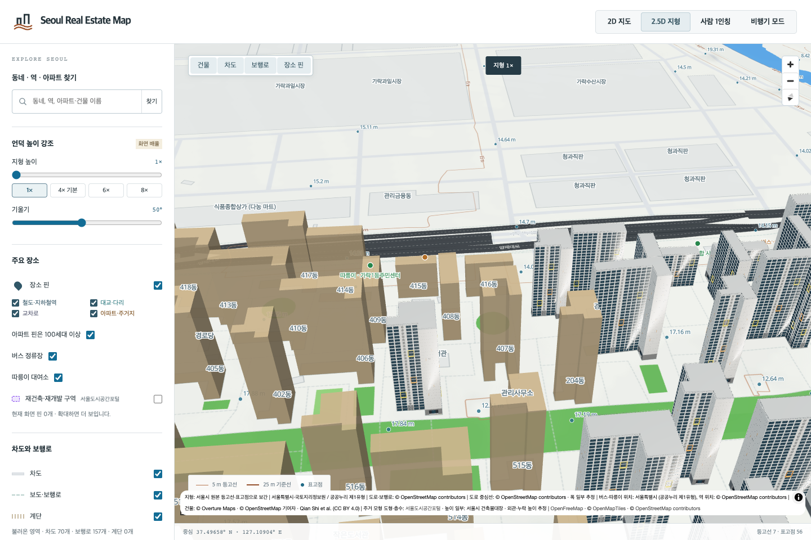

# 헬리오시티 51개 동 검토

헬리오시티 전체 84개 주거동 중 **101–112·201–219·301–318·401·416동, 51개 동**을 반영했습니다. 402–415·417–418·501–517동 **33개 동은 기존 개별 모형을 유지**합니다. 사용자가 정한 위클리 사용량 40%에 도달해 새 모델 제작을 중단한 범위이며, 단지 전체 완료로 집계하지 않습니다.

[KB32148](https://kbland.kr/se/c/32148)의 본문과 같은 객체에 있는 완공 사진 목록을 확인했습니다. 사진 목록 `photoList[2]`의 전경에는 **416동 번호와 전체 외벽·지붕**이 보입니다. 사진 목록 `photoList[1]`에는 502·503동이 보이지만 이번 모델 제작 범위에는 포함하지 않았습니다. 416동의 흰 외벽 격자, 짙은 청회색 창, 회색 서비스 창살, 노랑·주황색 입체 프레임, 창의 후퇴와 받침, 막힌 벽의 줄눈·색상 포인트, 후퇴한 출입구를 모델링했습니다.

기존 Blender MCP에서 대표 416동을 수정·렌더·독립 재로드한 뒤, 나머지 50개 동에는 **각자의 원천 평면·대장 높이·층수·동 번호**를 유지하며 외관을 유추해 적용했습니다. 판상형과 꺾인 평면을 구분하고 짧은 벽과 서비스 면은 개별 길이에 맞게 조정했습니다. 이 면 분류와 창 간격·정확한 방향·뒷면·색·출입구 및 프레임 치수는 실측 자료가 아닙니다. 대표 동의 12층 모형을 통째로 늘리지 않고 각 동의 실제 층수에 맞춰 창과 프레임 위치를 다시 구성했습니다.

총 **204개 최종 방향별 화면**을 검토했습니다. GLB를 별도로 읽어 지면·지붕 덮개가 원래 평면을 채우는지, 오목한 부분을 잘못 메우지 않는지, 대장 최대높이를 지키는지 확인했습니다. 지면의 외벽 장식은 0.5m 이내의 돌출을 허용하며 지붕 덮개에는 원천 평면 바깥 확장을 허용하지 않습니다. 부분별 높이 자료가 없으므로 동 전체에 대장 최대높이를 적용하는 가정은 남습니다.

[84개 동의 3,486쌍](songpa-helio-city-neighbor-spacing.json)을 비교한 최소 평면 간격은 약 2.505m입니다. 각각 0.5m 이내로 제한된 외벽 돌출을 고려해도 주거동끼리 겹치지 않습니다. 주변 부속 건물까지 포함한 측량 결과는 아닙니다.

동별 연결은 송파대로 345의 정확한 동 번호 대장과 이름이 확인된 OSM 단지 경계 안의 전체 도형을 대조했습니다. 전체 대장은 **84동·9,510세대**입니다. 공식 단지 대표 지번의 **가락동 479**와 대장 지번의 **가락동 913** 차이는 해결되지 않았으며, 같은 도로명·동 수·세대 수로 연결한 범위를 기록했습니다. [동별 출처와 한계](songpa-helio-city-source-identity.json)

기존 묶음 2개의 **21,975개 삼각형**은 당시 생성 결과를 바이트 단위로 재현하고 원래 출처별 생성 구간에 따라 나눴습니다. 44개 동을 개별화하고 원래부터 독립 모형인 40개 동과 이번 주거동 대상에 속하지 않는 6개 도형은 보존했습니다. 옛 볼록껍질 근사의 75개 삼각형도 보존하며 정밀도 향상으로 주장하지 않습니다. [분리 기록](songpa-helio-city-generic-split.json) · [84개 동 대체 모형 연결](songpa-helio-city-fallback-bindings.json)

사진 원본은 저장소와 모형에 포함하지 않습니다. 앞으로의 조사·모델 제작 역할과 검증 절차는 [AGENTS.md](../../AGENTS.md)에 기록했습니다. PR 업로드와 병합·배포 상태는 별도로 확인합니다.

브라우저에서는 51개 새 모형과 51개 대체 모형을 각각 3회 카메라 이동으로 확인했습니다. 대표 동 실패·여러 동 혼합 실패·원본 지도 복원과, 남은 33개 동 및 대상 외 6개 도형의 유지까지 7개 시나리오를 검증했습니다. 기존 묶음의 좌표 원점과 남은 도형 위치가 달라 검사 카메라는 실제 범위를 보도록 수정했고, 기존 모형의 근거리 로딩도 확인했습니다.

이번 GLB 합계는 **154.86MB**입니다. [검증 기록](songpa-helio-city51-local-validation.json)에 테스트·기존 파일 보존 결과를 남겼습니다. 전체 bespoke 422개, 서울 400세대 이상 대상 1,417개 관리코드 중 전체 주거동 검토 완료는 **23개**입니다.
